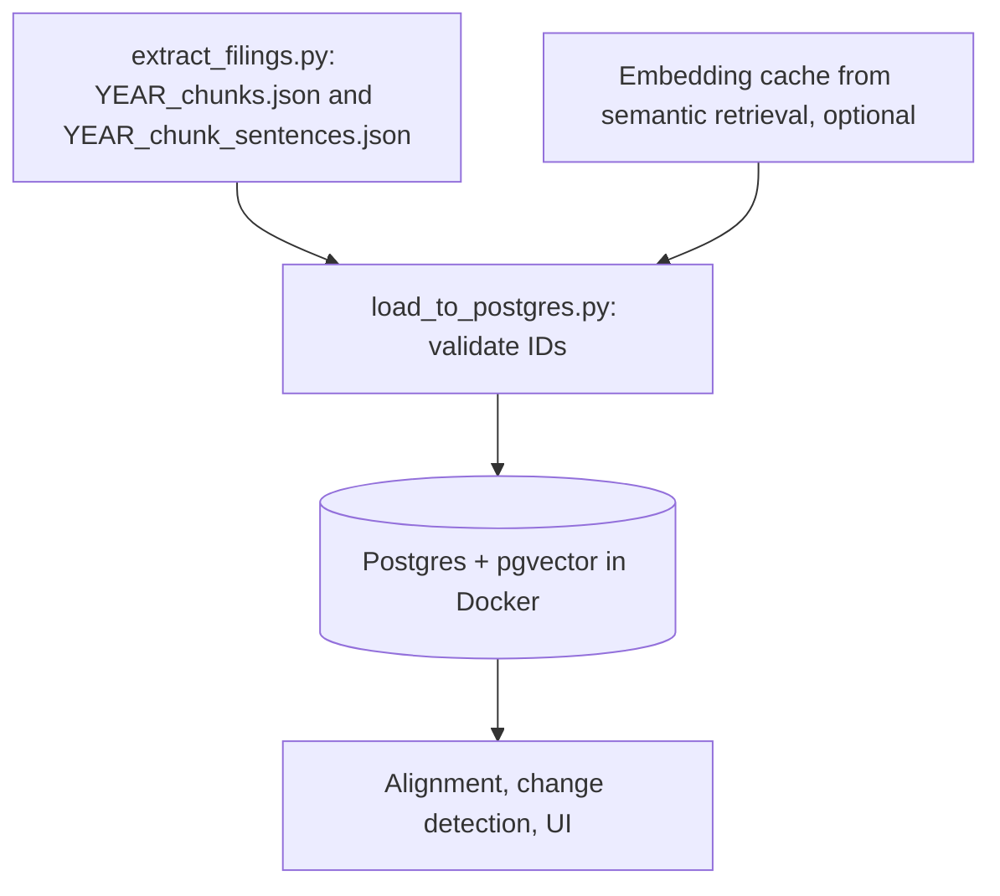

# YUVIKA: Database and Docker setup

**Maintainer:** YUVIKA — contact YUVIKA for database and Docker questions.

> Note: this is my first time using Docker. Everything here was tested on macOS with Docker Desktop; Windows and Linux are untested. If something looks wrong or could be done better, please tell me.

## 1. Purpose and implementation status

Give the text side of the project one local place to store and query its data: a
PostgreSQL database with the pgvector extension, started with one Docker command.
It stores the paragraph and sentence records written by
[text preprocessing](current_text_preprocessing_flow.md), and, through the loaders described in
[how to add a table](YUVIKA_how_to_add_a_table.md), the extracted disclosures, alignment results and
disclosure embeddings of the later stages. Downstream stages
(alignment, change detection, the UI) can read from it instead of reading JSON files.

Implemented:

- `docker-compose.yml` that starts Postgres 16 + pgvector with a persistent volume.
- Schema version 1 (`db/init/01_schema.sql`): `filings`, `chunks`, `sentences`,
  `embedding_models`, `sentence_embeddings`, a `sentence_context` view and `schema_info`.
- `scripts/load_to_postgres.py`: loads one company and fiscal year, idempotently.
- Optional load of sentence-level embeddings from the on-disk cache (`--embeddings-cache`). The team currently embeds whole disclosures instead, which use `scripts/load_disclosure_embeddings.py`.
- Example queries (`db/example_queries.sql`) and offline tests.
- Tables and loaders for extracted disclosures, alignment results and disclosure embeddings, plus a template for adding more: see [how to add a table](YUVIKA_how_to_add_a_table.md).

Not implemented (planned): financial table (XBRL) data, which belongs to the table side of the project;
any use of the SoC GPU server or a hosted database. The professor confirmed a fully local setup is sufficient.
Embeddings are stored at the level the semantic-retrieval stage uses, whole extracted disclosures
(`disclosure_embeddings`). The team agreed not to embed single sentences for now, so `sentence_embeddings`
is kept but unused.

Verification: tested on macOS with Docker Desktop (Docker 29.8.2, Compose v5.5.1), Python 3.14.5 and the `pgvector/pgvector:pg16` image. `docker compose up -d` reached the healthy state, the init script created the tables, and the UnitedHealth 2024 and 2025 test files loaded (855 and 930 sentences). Embedding loading was tested only with made-up vectors, not real `bge-m3` output.

## 2. Code and workflow

| Code | Responsibility |
| --- | --- |
| [`docker-compose.yml`](../docker-compose.yml) | Starts the `db` container (`pgvector/pgvector:pg16`), port, volume and health check |
| [`db/init/01_schema.sql`](../db/init/01_schema.sql) | Creates the extension, tables, indexes and view. Runs once, when the volume is first created |
| [`scripts/load_to_postgres.py`](../scripts/load_to_postgres.py) | Reads the preprocessing JSON for one company/year and writes it to Postgres (local computation only) |
| [`db/example_queries.sql`](../db/example_queries.sql) | Ready-made queries |
| [`tests/test_load_to_postgres.py`](../tests/test_load_to_postgres.py) | Offline tests for the loader's mapping and validation |



Everything here is local. No SEC, LLM or other network calls are made by the loader.

## 3. Setup

Requirements: Docker Desktop (Windows, macOS) or Docker Engine with the compose
plugin (Linux); Python 3.10+; the repository cloned.

1. Install Docker Desktop from the Docker website and start it. On Windows it will
   offer to enable WSL 2; accept and restart if asked. Wait until Docker Desktop shows "Engine running".
2. Check it works: `docker --version` and `docker compose version`.
3. From the repository root, install the Python dependencies (psycopg was added to
   [`requirements.txt`](../requirements.txt)):

   ```bash
   python3 -m venv .venv
   .venv/bin/python -m pip install -r requirements.txt
   ```

   On Windows PowerShell use `py -3 -m venv .venv` and `.venv\Scripts\python.exe`.
4. Optional: copy `.env.example` to `.env` and change the `POSTGRES_*` values. If you
   skip this, the defaults are user `sec`, password `sec_local_pw`, database
   `sec_disclosure`, port `5432`. These are for a local-only database; do not expose
   the port to a network. If you change the password after the first start, run
   `docker compose down -v` first, because the password is fixed when the volume is created.

The loader reads `.env` automatically (unlike the LLM client, which needs `--env-file`).
No API key is needed for anything in this guide.

## 4. Inputs

| Input | Producer | Required fields/shape | Required or optional |
| --- | --- | --- | --- |
| `data/raw/<company>/<year>/<year>_chunks.json` | `scripts/extract_filings.py` | Array of chunk objects, see section 6 | Required |
| `data/raw/<company>/<year>/<year>_chunk_sentences.json` | `scripts/extract_filings.py` | Array of sentence objects whose `chunk_id` exists in the chunks file | Required |
| `data/embeddings/<sha256>.json` | Embedding cache of the semantic-retrieval stage | JSON list of floats, 1024 long for `bge-m3`. File name is `sha256("<model>\0<text>")`. That stage embeds whole disclosures (content, summary, section), so these are read by `scripts/load_disclosure_embeddings.py`, not by this loader | Optional |

The loader stops with an error if chunk or sentence IDs repeat, or if a sentence points
to a chunk that is not in the chunks file. Both input files must come from the same
extractor run. IDs have the form `unh_2025_1A_P012` and `unh_2025_1A_P012_S003`.

## 5. Run and rerun

All commands from the repository root.

Start the database (first run downloads the image, then creates the tables):

```bash
docker compose up -d
docker compose ps
```

Wait until `ps` shows the container as `healthy`. Other lifecycle commands:

```bash
docker compose logs db        # see what Postgres printed
docker compose down           # stop, keep the data
docker compose down -v        # stop and DELETE all data (also re-runs the schema on next start)
```

Check the input files without touching the database:

```bash
.venv/bin/python scripts/load_to_postgres.py --company unh --year 2025 --dry-run
```

Load one filing (repeat per company and year):

```bash
.venv/bin/python scripts/load_to_postgres.py --company unh --year 2024
.venv/bin/python scripts/load_to_postgres.py --company unh --year 2025
```

Options:

| Option | Meaning |
| --- | --- |
| `--data-dir PATH` | Folder containing `<company>/<year>/` (default `data/raw`) |
| `--chunks PATH`, `--sentences PATH` | Use specific files instead |
| `--replace` | Delete that filing's rows first. Use this after the extractor changed and IDs moved, otherwise old rows stay behind |
| `--embeddings-cache PATH` | Also load vectors found in this cache folder |
| `--embedding-model NAME` | Model name used for the cache keys (default `bge-m3`, must exist in `embedding_models`) |
| `--dry-run` | Validate only |

A normal rerun with unchanged files updates the same rows and creates no duplicates.
If the files changed and the database holds rows that are no longer in them, the
loader exits with status 2 and tells you to rerun with `--replace`. Exit status 1 means
a missing file, an inconsistent input or a missing dependency.

Look at the data:

```bash
docker compose exec db psql -U sec -d sec_disclosure
```

then paste queries from [`db/example_queries.sql`](../db/example_queries.sql). Type `\q` to leave.
A graphical client (DBeaver, pgAdmin, the VS Code PostgreSQL extension) can connect to
`localhost`, port 5432, with the credentials above.

To change the schema: edit `db/init/01_schema.sql`, then `docker compose down -v` and
`docker compose up -d`, and reload the filings. The init script only runs on a fresh volume.

## 6. Final output JSON structure

The final output here is the table structure (schema version 1). Everything is in
the default `public` schema. `section_path` is an array so the hierarchy can be
filtered; `extra` is a JSON column that keeps any field the extractor adds later, so
a new field does not break the loader or require a migration.

**`filings`** (one row per company and year)

| Column | Type | Nullable | Meaning |
| --- | --- | --- | --- |
| `filing_id` | bigserial PK | No | Internal key. Changes if you reload with `--replace` |
| `company` | text | No | ID prefix, e.g. `unh` |
| `fiscal_year` | integer | No | Fiscal report year |
| `form_type` | text | No | Default `10-K`. Unique with company and year |
| `source` | text | Yes | File or URL the filing came from |
| `xbrl_taxonomy_version` | text | Yes | Reserved for the table side; not filled yet |
| `loaded_at` | timestamptz | No | Last load time |

**`chunks`** (one row per paragraph/block; from `YEAR_chunks.json`)

| Column | Type | Nullable | Meaning |
| --- | --- | --- | --- |
| `chunk_id` | text PK | No | e.g. `unh_2025_1A_P012` (from JSON `id`) |
| `filing_id` | bigint FK | No | Owning filing; rows are deleted with it |
| `item` | text | No | One of `1`, `1A`, `7`, `8`, `15` |
| `item_default_title` | text | Yes | Standard SEC title of the Item |
| `item_title` | text | Yes | Joined section hierarchy |
| `section_path` | text[] | No | Same hierarchy as a list; empty array if none |
| `item_chunk_index` | integer | No | The number in `_P012`. Unique per filing and Item |
| `text` | text | No | Paragraph text |
| `html_list_depth` | integer | Yes | List depth from the HTML, if any |
| `source` | text | Yes | Source file or URL |
| `extra` | jsonb | No | Unrecognised JSON fields, `{}` if none |

**`sentences`** (one row per sentence; from `YEAR_chunk_sentences.json`)

| Column | Type | Nullable | Meaning |
| --- | --- | --- | --- |
| `sentence_id` | text PK | No | e.g. `unh_2025_1A_P012_S003` |
| `chunk_id` | text FK | No | Parent chunk |
| `filing_id` | bigint FK | No | Copied from the chunk for fast filtering |
| `item`, `item_title`, `section_path` | text, text, text[] | Item: No | Copied from the chunk |
| `sentence_index` | integer | No | The number in `_S003`. Unique per chunk |
| `text` | text | No | Sentence text, never altered or split by the database |
| `char_count` | integer | No | Generated from `text` |
| `bullet_level`, `bullet_indent_pt`, `html_list_depth` | integer, numeric, integer | Yes | Bullet metadata; NULL for normal sentences |
| `source_block_index` | text | Yes | Empty string in the JSON becomes NULL |
| `source`, `extra` | text, jsonb | source: Yes | As for chunks |

**`embedding_models`**: `model_id`, `name` (unique, e.g. `bge-m3`), `dimension`, `notes`.
The row for `bge-m3` (1024 dimensions) is created by the init script.

**`sentence_embeddings`** (zero or more rows per sentence). Unused for now: the team agreed to embed whole disclosures only, see `disclosure_embeddings` in the how-to page. Kept in case sentence-level vectors are needed later.

| Column | Type | Nullable | Meaning |
| --- | --- | --- | --- |
| `sentence_id` | text FK | No | Sentence that was embedded |
| `model_id` | integer FK | No | Model that produced the vector |
| `part_index` | integer | No | 0 when the whole sentence was embedded; 1, 2, ... for extra parts of a long sentence |
| `part_text` | text | Yes | NULL when the whole sentence was embedded; otherwise the part's text |
| `embedding` | vector(1024) | No | The vector. Primary key is (`sentence_id`, `model_id`, `part_index`) |
| `created_at` | timestamptz | No | Load time |

An HNSW index with cosine distance (`<=>`) is created on `embedding`. The column size
is fixed at 1024 because pgvector can only index fixed-size vectors. A model with a
different size needs its own column or table, and the loader refuses vectors whose
length differs from the model's registered `dimension`.

**`sentence_context`** (view): sentence joined with company and fiscal year.
**`schema_info`**: `schema_version` = `1`.

Identity and ordering: chunk and sentence IDs are copied from the pipeline, so they are
the join keys to every other stage's JSON (disclosure evidence and alignment results
refer to the same IDs). Order sentences by `chunk_id, sentence_index`. IDs are only as
stable as the extractor: if extraction logic changes, reload with `--replace`.

## 7. Example data and downstream usage

Fixture dataset (scope: company `unh`, fiscal years 2024 and 2025, Items 1, 1A and 8,
every chunk and sentence the extractor produced for those two filings):

| File | Records |
| --- | --- |
| `tests/fixtures/db_loader/unh/2024/2024_chunks.json` | 109 chunks |
| `tests/fixtures/db_loader/unh/2024/2024_chunk_sentences.json` | 855 sentences |
| `tests/fixtures/db_loader/unh/2025/2025_chunks.json` | 117 chunks |
| `tests/fixtures/db_loader/unh/2025/2025_chunk_sentences.json` | 930 sentences |

SHA-256 of the files, in the order above:
`5e309dcb…`, `4734ce04…`, `b352c316…`, `d3fa463e…` (use `sha256sum` for the full values).
The `source` field in the fixtures was replaced by the bare file name so no machine path is committed.
They were produced by the extractor on `main` at commit `7776486` from a locally saved
copy of the UnitedHealth Group 10-Ks. Item 7 is missing from them (see section 8). They
contain no embeddings and no database rows; embedding rows depend on the embedding model.

Load them into a database without touching `data/`:

```bash
.venv/bin/python scripts/load_to_postgres.py --company unh --year 2024 --data-dir tests/fixtures/db_loader
.venv/bin/python scripts/load_to_postgres.py --company unh --year 2025 --data-dir tests/fixtures/db_loader
```

Expected result: `109 chunks, 855 sentences` and `117 chunks, 930 sentences`.

Downstream developers read the tables directly (for example
`SELECT ... FROM sentence_context WHERE company = 'unh' AND fiscal_year = 2025 AND item = '1A'`)
or with `psycopg` from Python using the same environment variables as the loader. This guide
does not change what the alignment or extraction stages read or write.

## 8. Validation and limitations

Offline tests (no database, no network, no API key):

```bash
PYTHONPATH=src .venv/bin/python -m unittest tests.test_load_to_postgres
```

Smoke test on your machine after `docker compose up -d` shows `healthy`:

```bash
.venv/bin/python scripts/load_to_postgres.py --company unh --year 2025 --data-dir tests/fixtures/db_loader
docker compose exec db psql -U sec -d sec_disclosure -c "SELECT count(*) FROM sentences"
```

The count should equal the sentences loaded (930 for a fresh database with only 2025).
A loaded result is complete when the loader prints equal chunk and sentence counts and
exits with status 0.

Known limitations:

- Local only: one database on one computer. Teammates each run their own copy; there is no shared server yet.
- The default password is for local use only. The database port is bound to 127.0.0.1, so only your own computer can connect.
- Financial (XBRL) table data is not in the database yet; that belongs to the table side of the project.
- Over-long sentences: the longest sentence in the fixtures is 1,345 characters, and the original always stays intact in `sentences`. Because embeddings are now made per disclosure, no sentence splitting is needed for now; if sentence-level vectors are ever needed, `sentence_embeddings.part_index` supports embedding long sentences in parts.
- `section_path` and IDs depend on the extractor version. Reload with `--replace` after extractor changes.
- Preprocessing observations from the fixtures (not caused by the database): about 240 replacement characters (�) appear in each UnitedHealth sentence file, where curly quotes were lost from the locally saved HTML; and Item 7 for UnitedHealth is not extracted by the extractor on `main` (the earlier version extracted it). Check against the SEC-downloaded HTML before relying on these filings.
- Structural validation only: the loader checks that records are consistent and loaded, not that the extraction is correct.
- Embedding loading was tested with synthetic vectors, not real `bge-m3` output.
