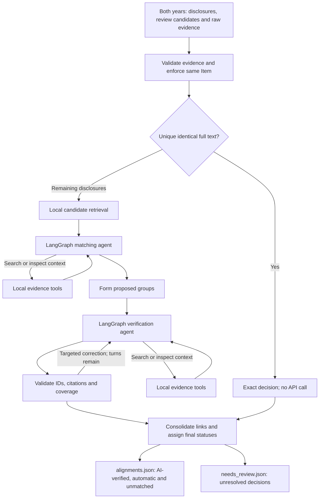

# ZIYANG: Disclosure alignment

**Maintainer:** ZIYANG — contact ZIYANG for disclosure-alignment questions.

## 1. Purpose and implementation status

Link saved disclosures for the same company across two fiscal years, within the
same SEC Item. The output supports a future downstream change-analysis stage.
Inputs come from [disclosure extraction](ZIYANG_disclosure_extraction.md).

Implemented: exact-text routing, local candidate retrieval, LangGraph matching
and verification agents, bounded automatic repair, supported overlapping links,
source validation, parallel jobs, two final JSON outputs and durable resume state. Both agents use the
configured model with different prompts. LangGraph coordinates the workflow; it
does not train the model or guarantee fewer review cases or faster API calls.

Not implemented: lexical/semantic/LLM change classification, materiality scoring,
and a human-in-the-loop review interface. `change_analysis` is a placeholder.

## 2. Code and workflow

| Code | Responsibility |
| --- | --- |
| [`scripts/align_disclosures.py`](../scripts/align_disclosures.py) | CLI entry point |
| [`agents/disclosure_alignment.py`](../src/sec_disclosure/agents/disclosure_alignment.py) | CLI, validators, report assembly and JSON/Markdown writers |
| [`agents/alignment_data.py`](../src/sec_disclosure/agents/alignment_data.py) | Read-only source validation, search/context tools and audit index |
| [`agents/alignment_exact.py`](../src/sec_disclosure/agents/alignment_exact.py) | Normalize complete selected source text and identify unambiguous equality |
| [`indexing/disclosure_retrieval.py`](../src/sec_disclosure/indexing/disclosure_retrieval.py) | Same-Item TF-IDF candidate ranking |
| [`agents/alignment_workflow.py`](../src/sec_disclosure/agents/alignment_workflow.py) | LangGraph job coordinator; matching proposals, groups and JSON jobs |
| [`agents/alignment_graph.py`](../src/sec_disclosure/agents/alignment_graph.py) | Agent model/tool/validation nodes, traces and SQLite checkpoints |
| [`agents/alignment_runtime.py`](../src/sec_disclosure/agents/alignment_runtime.py) | API-response cache, request ledger and usage/budget accounting |
| [`agents/alignment_prompts.py`](../src/sec_disclosure/agents/alignment_prompts.py) | Matching and verification prompts |
| [`agents/alignment_repair.py`](../src/sec_disclosure/agents/alignment_repair.py) | Incremental verifier repair and saved-run import |
| [`agents/alignment_grouping.py`](../src/sec_disclosure/agents/alignment_grouping.py) | Consolidate supported splits/merges, preserve original links and check conflicts |



The coordinator runs one job at a time by default. `--workers` allows independent
matching jobs to overlap, then independent verification jobs to overlap. All
matching jobs finish before grouping and verification begin. Each agent's own
model/tool/correction turns remain ordered; the agent chooses `search`, `context`
or its final action. LangGraph routes between model, tool and validation nodes.
The existing SoCLaaS Chat Completions client uses a JSON action protocol; native
provider tool calling is not required. Disclosure extraction remains a separate
Python workflow.

Exact matching compares the **entire original `content`**, never summaries or a
similarity threshold. It removes supported line-leading bullets and collapses
whitespace, preserving case, numbers, dates, punctuation and wording. Equality
must be unique in each year's same Item; repeated identical text is ambiguous and
is sent to the LLM. The stored SHA-256 is an audit fingerprint. Exact links skip
both agents, but extraction warnings still require review. Other agent searches
may find additional supported links involving an exact-matched disclosure.

For remaining anchors, local TF-IDF ranks selected text and summaries (65%/35%,
with small taxonomy/section bonuses), initially taking top five plus reverse
top-two candidates within the same Item. Taxonomy is not a hard filter and scores
are not probabilities. A missing candidate is not proof of absence. Matching
proposals are grouped, then verified with original citations and bounded targeted
corrections. Missing review metadata preserves links for review; bad IDs,
citations or omissions receive exact error feedback. Exhausted corrections remain
reviewable, with per-proposal audit records.

One-to-many, many-to-one and supported overlapping groups are allowed. Compatible
shared-anchor groups can be consolidated; original decisions remain in
`grouping.source_alignments`. Other supported overlaps retain their original
links: the code does not infer every edge in a many-to-many chain. Contradictory
matched/unmatched assignments and invalid evidence still need review. Count only
top-level status rows; nested source statuses are provenance, not extra cases.

## 3. Setup

Follow [shared setup](ZIYANG_llm_setup.md): Python 3.10+, requirements (including
LangGraph and SQLite checkpoints), and local `.env`. Both roles use
`SOCLAAS_BASE_URL`, `SOCLAAS_API_KEY` and `SOCLAAS_MODEL` via `--env-file .env`.
No extra LangGraph credential is required. Dry runs, report-only operations and
offline tests make no API calls. Normal agent requests use paid tokens.

## 4. Inputs

For AMD 2024–2025, both extraction runs must be complete:

| Location | Required files |
| --- | --- |
| `data/raw/amd/2024/` and `data/raw/amd/2025/` | Each year's `YEAR_chunks.json` and `YEAR_chunk_sentences.json` |
| `data/disclosures/amd/2024/` and `data/disclosures/amd/2025/` | `disclosures.json`, `review_candidates.json`, `excluded_sources.json`, `unassigned_sources.json`, `token_usage.json` |

See the [extraction JSON contract](ZIYANG_disclosure_extraction.md#6-final-output-json-structure).
Each year's `token_usage.json` must have `run_complete: true`. Both accepted and
review disclosures are loaded; audit text remains searchable separately. Source
hashes, IDs, parent text and Item metadata must match the original raw files.
Generated summaries do not replace original source evidence.

`--disclosures-dir` selects a root containing `ticker/year/`, not a single year
folder. It does not change raw-source lookup: that remains `--data-dir/raw/`.
Default `--data-dir` is `data`. Subsection names can differ between years; the
comparison's hard boundary is the SEC Item.

## 5. Run and rerun

Run from the repository root after completing both extraction years.

### Parallel alignment

Run up to **four matching jobs at once**, followed by up to **four verification
jobs at once**, using the completed extraction runs under `data/disclosures_run2`:

```bash
.venv/bin/python scripts/align_disclosures.py \
  --ticker amd \
  --previous-year 2024 \
  --current-year 2025 \
  --disclosures-dir data/disclosures_run2 \
  --output-dir data/alignments_parallel/amd/2024-2025 \
  --workers 4 \
  --request-interval 2 \
  --max-total-tokens 3000000
```

Add `--dry-run` to validate inputs without API calls or output writes. For
2023–2024, change both year flags and the output folder to `2023-2024`.
For new extraction from the parallel extraction guide, change
`--disclosures-dir` to `data/disclosures_parallel`. Add `--env-file .env` when
using a project env file instead of the default SoCLaaS configuration.

`--workers 4` caps simultaneous API calls at four for this comparison, with
starts spaced by `--request-interval 2`. Available independent jobs and the
provider's limits determine actual throughput. Each job keeps its own durable
graph thread and JSON checkpoint; finished jobs are retained if another fails.
Reports use deterministic job/source ordering despite out-of-order responses.
Separate CLI processes do not share this invocation's limiter.

Repeat the same command to resume. Changing workers or pacing alone does not
invalidate cached work. For saved runs created before this implementation change,
use a fresh output directory as above, or follow the cache revalidation rules
below. The final outputs remain `alignments.json` and `needs_review.json`.

### Default single-worker commands

Validate inputs and candidate retrieval with **no API calls or output writes**:

```bash
.venv/bin/python scripts/align_disclosures.py --ticker amd --previous-year 2024 --current-year 2025 --dry-run
```

Run alignment; **uncached agent calls use API tokens**:

```bash
.venv/bin/python scripts/align_disclosures.py --ticker amd --previous-year 2024 --current-year 2025 --env-file .env --max-total-tokens 3000000
```

Default destination: **`data/alignments/amd/2024-2025/`**. LangGraph and exact-text
routing are already enabled by the code. Use `--output-dir` only when you want
to override this destination. The 3,000,000-token example is a cap, not a
prediction or guarantee that a run will finish.

For extraction created under the alternative root in the extraction guide, use
a new alignment output directory:

```bash
.venv/bin/python scripts/align_disclosures.py --ticker amd --previous-year 2024 --current-year 2025 --env-file .env --disclosures-dir data/disclosures_run2 --output-dir data/alignments_parallel/amd/2024-2025 --max-total-tokens 3000000
```

For 2023–2024, prepare those two years and change `--previous-year` /
`--current-year`. Add `--max-new-requests 2` for a live pilot. Remove that option
to continue. Exact and cached decisions consume no new tokens; remaining prompts
do. Reusing 2024 extraction across comparisons does not incur extraction again.

### Resume and migration

Repeat the same command/output directory with unchanged inputs, model and
settings. Keep `requests/`, `jobs/`, `manifest.json` and the entire `graph/`
directory. The coordinator skips saved jobs; each active agent resumes its
pending node from `graph/checkpoints.sqlite`. Synchronous checkpoints preserve
turn counts, visible evidence and repair state. A saved API response is reused
if execution stopped before its graph checkpoint. An unsaved response cannot be
recovered and its token usage is unknown. API keys are not serialized as state.

Only one CLI invocation may use an output directory; its own workers coordinate
shared writes. An awake computer is required for
local execution. Restarting does not grant extra model turns. Raising a run budget
can continue pending work; exhausting a job's turn limit leaves review results.

Changed source inputs/model/settings require a fresh output directory.
Implementation or LangGraph-version changes may use explicit `--revalidate-cache`
when all other manifest inputs/settings match. This archives prior jobs/traces/
validation errors/graph state, keeps the API ledger and replays cached responses.
Exact cached prompts cost zero tokens; changed prompts can require paid calls.
Historical cross-Item runs cannot be resumed/imported under the same-Item policy.

### Limits and failures

| Option | Default / behavior |
| --- | --- |
| `--top-k`, `--batch-size` | 5 candidates and 6 current anchors per matching job, scoped to one Item |
| `--workers` | 1 by default; maximum concurrent jobs/API calls within each matching or verification phase |
| `--request-interval` | 2 seconds between request starts with multiple workers; otherwise 0 |
| `--rate-limit-cooldown` | Shared 60-second pause after HTTP 429, extended by numeric `Retry-After` |
| `--max-steps` | 4 model turns per job, including tool requests and corrections |
| `--max-requests` | 400 cumulative paid attempts, including prior runs of the same output directory |
| `--max-new-requests` | Optional limit on new attempts this invocation |
| `--max-total-tokens` | 1,500,000 by default; sample command explicitly raises it to 3,000,000 |
| `--max-tokens`, `--timeout` | 6,000 completion tokens; 180 seconds per call |
| `--max-prompt-chars` | 150,000 combined characters; oversized context is not silently truncated |
| `--retry-failed` | Explicitly acknowledge prior failed/interrupted attempts and allow another paid attempt |

Admission budgeting atomically reserves UTF-8 prompt bytes plus maximum completion tokens;
this is a conservative estimate, not provider billing. Unknown usage from prior
failures stays unknown. With `--retry-failed`, each acknowledged attempt gets an
estimate in `unknown_usage_budget_reserve`; `budget_accounted_tokens` includes it
and reported usage. Active calls are tracked in `in_flight_budget_reserve` and
count against the token cap until their usage is recorded; they do not trigger
the unknown-usage stop while still running. Request caps include every admitted
attempt, including retries. New failures stop admission of later jobs while
already admitted work finishes and checkpoints. Successful responses missing
usage cannot be acknowledged with that flag. Requests have no automatic client
retries. Consult `token_usage.json`; do not interpret unknown usage as free.

### Optional saved-run operations

These require the existing output directory and its matching original input
paths; append the same `--disclosures-dir` used for that run when applicable.
Each operation below is separate from a normal run:

```bash
.venv/bin/python scripts/align_disclosures.py --ticker amd --previous-year 2024 --current-year 2025 --output-dir data/alignments/amd/2024-2025 --regroup-only
.venv/bin/python scripts/align_disclosures.py --ticker amd --previous-year 2024 --current-year 2025 --output-dir data/alignments/amd/2024-2025 --refresh-extraction-policy
```

Both are **offline, no API key/calls**. They validate the original inputs,
archive affected reports under `archives/`, refresh exports and save a grouping
or policy summary. `--regroup-only` consolidates supported links and records
retired IDs in grouping provenance; it does not perform new model verification.
`--refresh-extraction-policy` updates effective source warnings without changing
historical extraction files. Unchanged repeated refreshes are no-ops.

To repair a saved same-Item run in a separate folder:

```bash
.venv/bin/python scripts/align_disclosures.py --ticker amd --previous-year 2024 --current-year 2025 --env-file .env --repair-from data/alignments/amd/2024-2025 --output-dir data/alignments_repair/amd/2024-2025 --offline-repair --max-total-tokens 50000
```

`--offline-repair` makes no API calls but the CLI still loads configuration when
non-exact work exists. It imports saved responses and applies local repairs;
unresolved work remains partial. Omit `--offline-repair` on the next invocation
to permit paid targeted corrections, with the same other arguments. Each repair
job gets its own bounded new turns. Historical source usage appears separately
as `source_run_reported_tokens`; do not count it twice. Repair preserves its
source run's exact-routing policy rather than inventing new exact decisions.

## 6. Final output JSON structure

Current report `schema_version` is the **string `"8"`**. There are exactly two
final result files:

| File | Included top-level statuses |
| --- | --- |
| `alignments.json` | `ai_verified`, `auto_matched`, `unmatched` |
| `needs_review.json` | `needs_review`, including unfinished verification |

**The two files together are canonical.** Their rows partition all decisions
without duplicate match IDs. Review rows appear only in `needs_review.json`.
Supported links may still share disclosure IDs. Until `run_complete` is true,
single-sided no-counterpart decisions stay in `needs_review.json`; finalized
matched decisions may already appear in `alignments.json`.

Unmatched rows have `status: "unmatched"` and an explicit `unmatched_type`:
`introduced_disclosure` for `current_only`, or `removed_disclosure` for
`previous_only`. These labels apply within the saved disclosure comparison.
Separate AI-verified, unmatched, review-candidate and per-year unmatched exports
are no longer written. When refreshing older outputs, redundant result views
are moved under `archives/legacy_result_views_*/`. Audit and resume files remain
supporting artifacts.

Complete JSON output documents are included without sampling:

- AMD 2023–2024: [alignments.json](../tests/fixtures/alignments/amd/2023-2024/alignments.json) and [needs_review.json](../tests/fixtures/alignments/amd/2023-2024/needs_review.json)
- AMD 2024–2025: [alignments.json](../tests/fixtures/alignments/amd/2024-2025/alignments.json) and [needs_review.json](../tests/fixtures/alignments/amd/2024-2025/needs_review.json)

They are verbatim copies of the newest completed LangGraph runs for both AMD
comparisons at `data/alignments_run2/amd/{2023-2024,2024-2025}/`. They retain every decision, source ID,
sentence citation, disclosure metadata and grouping record. Copying the fixture
made no API calls.

### Status-file envelope

All fields below are required. Only `error` is nullable.

| Field | Type | Meaning |
| --- | --- | --- |
| `schema_version`, `company` | string | `"8"`; lowercase ticker |
| `previous_year`, `current_year` | string | Increasing fiscal years, e.g. `"2024"`, `"2025"` |
| `run_complete` | boolean | All planned jobs processed, even if some results need review |
| `error` | string or null | Run-level stopping error, or null |
| `note` | string | Scope and interpretation qualifications |
| `comparison_scope` | string | `same_item` for current runs; legacy exports may say `legacy_all_items` |
| `included_statuses` | array<string> | Statuses this view can contain |
| `alignment_count` | integer >= 0 | Number of rows in this file |
| `counts`, `overall_counts` | object<string, integer> | Per-status counts in this file / across both files; absent status keys mean zero |
| `alignments` | array<object> | Alignment records; may be empty |

Both files additionally record `coverage` (input/represented disclosure counts and arrays
of pending, conflicting and permitted-overlap IDs), `grouping_summary`,
`assignment_policy`, `source_unit_policy`, and, when written for an exact-routing
run, `automatic_matching` (policy, exact pair count, zero exact API usage and
source-warning pair count). These metadata describe the complete comparison,
including records in the other result file.

### Alignment records and nested fields

Fields are required and non-null unless explicitly marked optional. Empty arrays
and empty strings are meaningful values, not missing/null fields.

| Field/path | Type / values | Meaning |
| --- | --- | --- |
| `match_id` | string | Run-scoped ID, e.g. `amd_2024_2025_M0001` |
| `previous_ids`, `current_ids` | array<string> | Original disclosure IDs; at least one side nonempty |
| `relationship` | string enum | `one_to_one`, `one_to_many`, `many_to_one`, `many_to_many`, `previous_only`, `current_only` |
| `status` | string enum | `auto_matched`, `ai_verified`, `unmatched`, `needs_review` |
| `explanation`, `verifier_review_reason` | string | Decision explanation; verifier reason may be empty |
| `review_reasons` | array<string> | Active review tags; empty for accepted/unmatched records |
| `match_method` | optional string enum | `exact_text`, `llm`, `exact_text_and_llm`; may be absent on unfinished fallback records |
| `evidence` | array<object> | Original citations; may be empty on unfinished/invalid records |
| `evidence[].disclosure_id` | string | One of the row's member IDs |
| `evidence[].sentences` | array<object> | Each citation has required string `sentence_id`, `paragraph_id`, `source_url`, `text` |
| `previous_disclosures`, `current_disclosures` | array<object> | Member metadata corresponding to each side's IDs |
| Member metadata fields | strings | `disclosure_id`, `item`, `section`, `taxonomy`, `summary`, `extraction_status` |
| `extraction_status` | string enum | `source_validated` or `needs_review`; effective source policy applied |
| `exact_match` | optional object | Exact rows: string `policy` and `normalized_text_sha256`; mixed groups retain it in source provenance |
| `unmatched_notes` | optional array<string> | Qualifications on a validated unmatched result |
| `unmatched_type` | required for `unmatched` only | `introduced_disclosure` for current-only; `removed_disclosure` for previous-only |
| `metadata_repairs` | optional array<string> | Review fields repaired locally, e.g. `needs_review`, `review_reason` |
| `validation_errors` | optional array<object> | Unresolved proposal diagnostics: event references and exact error records |
| `grouping` | optional object | String `method` and `source_alignments[]` preserving original IDs, relationships, evidence, status and optional repair/exact metadata |
| `change_analysis` | object | Required placeholder described below |

`evidence` contains selected citations, not necessarily all original disclosure
text. To analyze complete selected content, join each side's IDs to the original
extraction records' `content` and `sources`. The nested member metadata does not
contain that full text. Content taxonomy is the original subject category; it
is not change taxonomy.

`auto_matched` means full-text equality under the exact policy. `ai_verified`
means model acceptance plus structural/source checks, not human verification.
`unmatched` requires a supported verifier decision, citations and no conflicting
assignment; an empty side alone is insufficient. Its limitations remain in
`unmatched_notes`, `verifier_review_reason` and nested source status.
`needs_review` includes unresolved semantics, source warnings, invalid proposals,
contradictions or unfinished jobs. Missing review metadata alone preserves a
proposed link; it does not certify it as accepted.

Every row initially has this **complete object**, not a calculated result:

```json
{
  "status": "not_started",
  "lexical": null,
  "semantic": null,
  "llm": null,
  "final_taxonomy": null
}
```

Inside `change_analysis`, all five fields are required. `status` is currently the
string `not_started`; the other fields are nullable and initially null. Their
future result schemas/status values are not implemented. Do not assume exact
matches have already been classified as unchanged. `unmatched_type` identifies
introduced/removed disclosures within the saved comparison; it is separate from
the future change-analysis taxonomy. `change_type` is not emitted by this workflow.

A downstream classifier should load all decisions with
`load_alignment_report(output)`, update a finalized row's `change_analysis` by
`match_id`, then write the two files with
`write_alignment_json_reports(output, report)`. Both helpers make no API calls;
the writer produces no Markdown. The loader also accepts older combined reports.
Cached regeneration preserves analysis only when the match ID and remaining row
are unchanged. IDs are not stable across fresh model runs; keep the run/company/
year context. Consolidation can leave ID gaps and preserves original identifiers
in `grouping.source_alignments`.

### Supporting files

| File/directory | Contents |
| --- | --- |
| `token_usage.json` | Reported prompt/completion/total tokens, known/unknown usage and budgets; extraction usage listed separately |
| `automatic_matches.json`, `candidate_matches.json` | Exact decisions and initial retrieval rankings |
| `matching_proposals.json`, `proposed_groups.json` | Agent matches and groups before verification |
| `validation_errors.json`, `validation_errors/` | Per-job/per-proposal errors, repairs and resolution status |
| `requests/`, `traces/` | Exact API prompts/responses/usage and model/tool/validation history; API keys are not stored |
| `jobs/`, `graph/checkpoints.sqlite`, `manifest.json` | Resume state, source/code/settings hashes and orchestration/package versions; keep SQLite side files with `graph/` |
| `archives/` | Historical reports and obsolete result views retained during migrations |
| `alignments.md` | Generated readable report; the current CLI still writes it |

Only completed runs put unmatched records in `alignments.json`. A malformed
response's tokens still count; extraction tokens are not added
to the alignment total. Repair source usage is reported separately. No monetary
estimate is provided without verified account/model billing rates.

## 7. Example data and downstream usage

The newest completed AMD alignment runs are saved under
`tests/fixtures/alignments/amd/{2023-2024,2024-2025}/`, with two final JSON files
per comparison:

| Comparison | `alignments.json` | `needs_review.json` |
| --- | --- | ---: |
| 2023–2024 | 376: 199 `ai_verified`, 106 `auto_matched`, 71 `unmatched` | 34 |
| 2024–2025 | 391: 238 `ai_verified`, 71 `auto_matched`, 82 `unmatched` | 51 |

All 410 decision rows for 2023–2024 are included, representing all 832 input
disclosures; its unmatched rows contain 20 `introduced_disclosure` and 51
`removed_disclosure` decisions. All 442 decision rows for 2024–2025 are included,
representing all 839 input disclosures; its unmatched rows contain 43
`introduced_disclosure` and 39 `removed_disclosure` decisions. Each row retains
its saved metadata, evidence, review/unmatched notes and grouping provenance.
The fixture contains exactly four JSON files, two per comparison; raw filings,
extraction outputs, audits, manifests,
archives and runtime caches remain in the local `data/` run directories.

All four files are byte-for-byte copies from
`data/alignments_run2/amd/{2023-2024,2024-2025}/`, using schema `"8"` with
`run_complete: true`. Their SHA-256 hashes are:

| Comparison | File | Bytes | SHA-256 |
| --- | --- | ---: | --- |
| 2023–2024 | `alignments.json` | 2,008,131 | `40b76bd98245e51cd40d8bff4b20f207b82bf9a3c4a83060649afa1fb339af61` |
| 2023–2024 | `needs_review.json` | 351,396 | `42982af36eb3bf88303ef6d3055102b22cfe7b92d9caf273fa16328eb1253f98` |
| 2024–2025 | `alignments.json` | 2,028,537 | `6259a1d084bb0b9566822ac39af534ccd455f903a85e85807972681dcb068dbf` |
| 2024–2025 | `needs_review.json` | 267,950 | `06e04e15e0655b54b24b3cc3a91fcffd1b86f48c701d123e0b04cd4a6a3efdf6` |

Copy the final files to a separate local directory; **no API access**:

```bash
mkdir -p data/fixture_runs/amd/alignments/amd
cp -R tests/fixtures/alignments/amd/2023-2024 tests/fixtures/alignments/amd/2024-2025 data/fixture_runs/amd/alignments/amd/
```

Read accepted links and introduced/removed disclosures from
`alignments.json` in each copied comparison directory, and
unresolved decisions from `needs_review.json` beside it.
Use `load_alignment_report(output)` to read both files as one complete report.
For full selected disclosure text or source validation, join `previous_ids` /
`current_ids` to both `disclosures.json` and `review_candidates.json` under
`data/disclosures_run2/amd/{2023,2024,2025}/`. These extraction files are local inputs
and are not part of the fixture. Alignment evidence contains selected citations,
while `previous_disclosures` / `current_disclosures` contain member metadata.
Use the two-file loader/writer for canonical updates, and handle unmatched/review
rows according to the downstream policy.

With the local source runs present, validate alignment inputs without API calls
or writes:

```bash
.venv/bin/python scripts/align_disclosures.py --ticker amd --previous-year 2024 --current-year 2025 --disclosures-dir data/disclosures_run2 --dry-run
```

To rerun from those local inputs, choose a fresh output directory. This can make
paid API calls and produce different decisions:

```bash
.venv/bin/python scripts/align_disclosures.py --ticker amd --previous-year 2024 --current-year 2025 --env-file .env --disclosures-dir data/disclosures_run2 --output-dir data/alignments_fixture_rerun/amd/2024-2025 --max-total-tokens 3000000
```

For 2023–2024, use `--previous-year 2023 --current-year 2024` and a separate
`data/alignments_fixture_rerun/amd/2023-2024` output directory.

The fixture supports downstream reading of both full final reports. Fresh pipeline
runs require the separate raw and extraction inputs; cached resume also requires
the original compatible manifests, API caches and runtime checkpoints. Copying
the final files does not rerun the pipeline or restore that state.

## 8. Validation and limitations

Existing tests run offline with mocked API responses:

```bash
PYTHONPATH=src .venv/bin/python -m unittest discover -s tests -p 'test_disclosure_alignment.py'
```

Exit `0` means all jobs processed; `2` means a budget/request pause or offline
repair with pending corrections; `1` means invalid inputs or an execution/API
error. Inspect `run_complete`, `error`, `coverage` and `token_usage.json` together.
A partial run's review count includes unprocessed work and is not a final quality
measurement. A complete run can still have `needs_review` records.

The pipeline covers saved narrative disclosures, not all filing text or tables.
Unmatched does not prove filing-wide absence. Extraction uncertainty can propagate
into matches; single sentences and partial paragraphs are allowed, while only
retired minimum-length/unassigned-neighbor flags are waived. Contradictory
assignments still require review even though supported overlap is permitted.
Automatic repair addresses processing failures; it cannot guarantee semantic
agreement, fewer than ten review cases, or speed improvements from LangGraph.
Fresh model runs can produce different groupings. These fixtures illustrate the
contract and make no performance claim.
