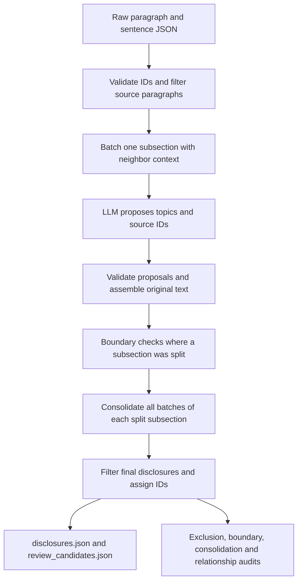

# ZIYANG: Disclosure extraction

**Maintainer:** ZIYANG — contact ZIYANG for disclosure-extraction questions.

## 1. Purpose and implementation status

Turn the saved paragraphs and sentences for one company and fiscal year into
focused disclosures, ready for [alignment](ZIYANG_disclosure_alignment.md). Each
retained disclosure contains selected original evidence, a generated summary,
a topic label and one of the nine content categories.

Implemented: one-subsection grouping, one-sentence/partial-paragraph selections,
pre/post extraction filters, shared batch context, boundary reconciliation,
whole-subsection consolidation and relationship links,
source validation, parallel year jobs and batches with shared request pacing, optional
fault-tolerant retries/resume, review/audit exports and token accounting. Topic coherence,
summaries and taxonomy are model judgments; source checks do not certify them.
No training, human-review UI or change classification is implemented here.

Use [backend_stage_template.md](backend_stage_template.md) for other stages.

## 2. Code and workflow

| Code | Responsibility |
| --- | --- |
| [`scripts/extract_disclosures.py`](../scripts/extract_disclosures.py) | CLI entry point |
| [`llm/disclosures.py`](../src/sec_disclosure/llm/disclosures.py) | `load_filing`, `make_batches`, `SYSTEM_PROMPT`, model response validation, evidence assembly, `save_outputs`, CLI/resume logic |
| [`llm/disclosure_filters.py`](../src/sec_disclosure/llm/disclosure_filters.py) | Shared single-sentence/trailing-colon predicate and policy identifiers |
| [`llm/disclosure_boundaries.py`](../src/sec_disclosure/llm/disclosure_boundaries.py) | Neighbor context, `BOUNDARY_SYSTEM_PROMPT`, validation and reconciliation of split subsections |
| [`llm/disclosure_consolidation.py`](../src/sec_disclosure/llm/disclosure_consolidation.py) | Compare all extracted candidates in a split subsection, merge coherent fragments and link related independent disclosures |
| [`llm/response_retries.py`](../src/sec_disclosure/llm/response_retries.py) | Latest-response correction context, prompt-size handling and validation of saved review fallbacks |
| [`llm/request_pacing.py`](../src/sec_disclosure/llm/request_pacing.py) | Thread-safe request spacing and shared HTTP 429 cooldown for year jobs |
| [`llm/client.py`](../src/sec_disclosure/llm/client.py) and [`config.py`](../src/sec_disclosure/llm/config.py) | API requests and local configuration |



`disclosures.py` writes all extraction outputs. The model returns integer evidence
references; Python retrieves the original text from input files. A disclosure
stays in one SEC Item and one detected subsection (`item_title` path). Parent and
child paths differ; the validator rejects cross-subsection selections.
The workflow above runs separately for every selected year. `--years` overlaps
year jobs while preserving each year's batch and boundary-check order.

**Filtering:** before batching, exclude a paragraph only if it has exactly one
original sentence record and its full text ends with `:` after trailing whitespace
is removed. After boundary reconciliation and consolidation, apply the same rule to the final
selected disclosure text and sentence count, before assigning disclosure IDs.
Both exclusions go to `excluded_sources.json`; original input files stay intact.
The rules do not require table keywords and amounts do not override them.
Two-sentence paragraphs or single sentences ending in a period survive this rule.
A `possible_missing_table_context` warning alone does not exclude a disclosure.

A whole subsection stays together when it fits the batch target. Large subsections
split at paragraph boundaries. Each sentence belongs to one request; up to two
neighbor paragraphs per side from the same subsection are read-only context,
capped at 4,000 serialized characters per side. Context IDs cannot be selected.
After extraction, model boundary checks may keep independent disclosures or merge
same-topic fragments. They must account for all candidates, preserve the exact
union of selected source IDs, and cannot invent/drop evidence or split candidates.
Checks run in source order; later checks see earlier merges. Invalid checks leave
their candidates unchanged. Missing-table and other unrelated warnings survive.

**Consolidation:** after extraction and all boundary checks succeed, review every
remaining candidate and its full selected source sentences from each split
subsection together. Batch 1 and batch 5 can merge even when unrelated disclosures
occur between them. Candidates that share context but represent distinct topics
can instead receive an explicit relationship. A shared heading or taxonomy alone
does not justify merging. The pass never crosses Item or subsection boundaries;
equal headings separated by another subsection are treated as separate runs.
Single-batch subsections and runs with fewer than two remaining candidates need
no additional call.

The model returns candidate IDs and concise metadata. Python preserves the exact
union of original source sentences, paragraph provenance, batch/proposal lineage
and existing review concerns. Invalid or truncated decisions leave all candidates
unchanged and require retry. Decisions, complete inputs and hashes are recorded in
`consolidation.json`. Links are resolved to final disclosure IDs in
`disclosure_relationships.json` and each record's `related_disclosures` field.
Relationship links are model judgments, not independent semantic verification.

## 3. Setup

Follow [shared setup](ZIYANG_llm_setup.md) for Python 3.10+, dependencies and `.env`.
Use `--env-file .env` on live commands. Required settings are `SOCLAAS_BASE_URL`,
`SOCLAAS_API_KEY` and `SOCLAAS_MODEL`; never put credentials in output examples.
Dry runs and the offline tests below do not need a key or make API calls.

## 4. Inputs

Upstream producer: [`scripts/extract_filings.py`](../scripts/extract_filings.py).
For each year, supply:

| Input path | Shape and required information |
| --- | --- |
| `data/raw/amd/2024/2024_chunks.json` | Array of paragraphs: `id`, `company`, `year`, `item`, `item_title`, `text`, `source`; optional source block metadata |
| `data/raw/amd/2024/2024_chunk_sentences.json` | Array of sentences: `id`, parent `chunk_id`, `sentence_index`, `text` and matching company/year/Item/subsection metadata |

Use the equivalent paths for 2025. IDs must be unique, sentence parents must
exist, and metadata/source text must agree. The loader records file hashes.
Current supported Items are `1`, `1A`, `7`, `8`, and `15`; actual availability
comes from preprocessing. Tables are not reconstructed by disclosure extraction.

From a fresh clone, prepare both AMD fiscal years with these **SEC network calls,
using no LLM tokens**. Replace the contact placeholder:

```bash
.venv/bin/python scripts/extract_filings.py --ticker amd --year 2024 --user-agent "Your Name your.email@example.com"
.venv/bin/python scripts/extract_filings.py --ticker amd --year 2025 --user-agent "Your Name your.email@example.com"
```

The year is the fiscal report year, not the publication year. Skip this step only
when the required complete raw JSON already exists. `data/` is ignored by Git.

## 5. Run and rerun

Run all commands from the repository root.

### Extract and align with one command

After the raw filing inputs exist, extraction and alignment can run together:

```bash
.venv/bin/python scripts/extract_disclosures.py \
  --ticker amd \
  --years 2023 2024 2025 \
  --workers 3 \
  --batch-workers 10 \
  --max-concurrent-requests 30 \
  --output-root data/disclosures_parallel \
  --align \
  --alignment-output-root data/alignments_parallel \
  --fault-tolerant \
  --max-retries 10 \
  --retry-backoff 5
```

All selected extraction years, including their boundary checks, must finish
successfully before alignment starts. Selected years are sorted chronologically
and adjacent selections are aligned: here, 2023–2024 and 2024–2025 run concurrently.
`--align` requires at least two years. An extraction failure or request-limited
pause skips alignment. An alignment failure or pause is reported while other
independent pairs continue; the command returns a failure or partial exit code
after all comparisons finish or checkpoint.
Rerun the same command to resume both stages using saved successful work.

The disclosure root is forwarded to alignment automatically. The default
alignment output root is `data/alignments` (under `--data-dir`); the example uses
`data/alignments_parallel/amd/{2023-2024,2024-2025}/`.
The stages share the env file, completion limit, timeout, request interval,
HTTP 429 cooldown, fault tolerance and retry settings. Extraction concurrency
uses `--workers`, `--batch-workers` and `--max-concurrent-requests`; alignment
automatically inherits the same effective API concurrency. In this example, both
stages allow up to 30 simultaneous requests **in total**, including all alignment
pairs combined. The inherited worker count per pair is
`min(selected years, --workers) × --batch-workers`, reduced by any smaller
`--max-concurrent-requests` cap. `--alignment-workers` remains an optional
override, also limited by `--max-concurrent-requests`.
`--alignment-pair-workers` defaults to 3 concurrent comparisons, or fewer when
fewer pairs are selected; use `--alignment-pair-workers 1` for sequential pairs.
All pairs share one API limiter, request-start interval and HTTP 429 cooldown.
Without an explicit `--max-concurrent-requests`, their shared request cap equals
the per-pair alignment worker count. An explicit cap can allow more total calls,
subject to the number of active pairs and their workers. Each pair can use the
available shared slots; they are not divided into fixed allocations. Outputs,
request/token budgets, caches and retry accounting remain separate per pair.
Startup logs show the pair capacity, per-pair workers and shared API request cap.

`--max-retries 10` limits temporary API retries. Invalid model replies use a
separate `--max-response-retries 3` limit: one initial reply plus three correction
attempts. Corrections include the latest raw reply, validation error and original
evidence, with waits of 1, 2 and 4 seconds (`--response-retry-backoff 1`). Exhausted
boundary/consolidation corrections preserve original candidates as `needs_review`
and let later work and alignment proceed. An initial extraction batch without
valid selections remains failed; later batches and other years continue, but
alignment waits for missing extraction results on a later resume.
Set `--max-retries -1` for unlimited temporary API retries; model corrections
remain bounded separately. API retry delays double up to 60 seconds; HTTP 429
uses the shared cooldown. Authentication, permission, configuration and
exhausted-quota errors still stop the affected stage.
Alignment's schema/evidence correction turns remain separately bounded by
`--alignment-max-steps` (default 4).

Alignment retains its defaults of 400 cumulative requests and 1,500,000 tokens
per pair. To remove those caps too, add:

```text
--alignment-max-requests -1 --alignment-max-total-tokens -1
```

`--max-requests` still optionally caps new extraction requests per year;
`--alignment-max-new-requests` optionally pauses new alignment requests per pair.
All attempts stay in the usage ledgers, including failures with unknown usage.
Add `--alignment-revalidate-cache` when resuming saved alignment after an
implementation-only change, following the alignment guide's cache rules.
`--dry-run` validates the raw extraction inputs and prints the planned pairs
without API calls or output writes; alignment evidence validation happens after
extraction has generated its outputs.

### Parallel run with fault tolerance

Use this command to extract **2023, 2024 and 2025 concurrently with automatic
recovery**. All three years' raw input files must already exist. Live extraction
uses API tokens.

```bash
.venv/bin/python scripts/extract_disclosures.py \
  --ticker amd \
  --years 2023 2024 2025 \
  --workers 3 \
  --batch-workers 10 \
  --max-concurrent-requests 30 \
  --output-root data/disclosures_parallel \
  --fault-tolerant \
  --max-retries 10 \
  --retry-backoff 5
```

`--years` selects the filings; `--workers 3` runs up to three year jobs at once.
`--batch-workers 10` runs up to ten extraction batches **within each year**.
Together they allow up to 30 active batch jobs; `--max-concurrent-requests 30`
allows up to 30 simultaneous API calls across the whole invocation. Request starts
remain spaced by the shared default two-second interval.
`--fault-tolerant` retries temporary API errors up to 10 times and corrects invalid
replies up to 3 times. API waits start at five seconds (`--retry-backoff 5`);
corrections wait 1, 2 and 4 seconds (`--response-retry-backoff 1`). Recoverable
failed extraction batches stay recorded while later batches and other years
continue. Exhausted boundary/consolidation corrections preserve candidates for
review and continue. Boundary API failures still hold their dependent checks.

Outputs, caches and token ledgers are separate under
`data/disclosures_parallel/amd/{2023,2024,2025}/`. Rerun the **same command** to
resume recoverable failed or interrupted jobs and reuse successful cached work.
Unresolved failures remain `run_complete: false`; permanent authentication or
configuration failures need correction. Add `--env-file .env` if using a project
env file instead of the default SoCLaaS configuration.

Validate this parallel command first, **without API calls or output writes**:

```bash
.venv/bin/python scripts/extract_disclosures.py \
  --ticker amd \
  --years 2023 2024 2025 \
  --workers 3 \
  --batch-workers 10 \
  --max-concurrent-requests 30 \
  --output-root data/disclosures_parallel \
  --fault-tolerant \
  --max-retries 10 \
  --retry-backoff 5 \
  --dry-run
```

### Single-year commands

Run batches concurrently even when extracting just **one year**:

```bash
.venv/bin/python scripts/extract_disclosures.py \
  --ticker amd \
  --year 2024 \
  --batch-workers 4 \
  --max-concurrent-requests 4 \
  --output-dir data/disclosures_parallel/amd/2024 \
  --fault-tolerant \
  --max-retries 10 \
  --retry-backoff 5
```

Add `--dry-run` to check this command without API calls or output writes.
This example shares the 2024 output/cache with the multi-year command above;
run one invocation at a time against that directory. Adjusting worker counts,
pacing or the shared concurrency cap preserves cached successful work.

Check input validity and planned batches first; these **do not call the API or
write outputs**:

```bash
.venv/bin/python scripts/extract_disclosures.py --ticker amd --year 2024 --dry-run
.venv/bin/python scripts/extract_disclosures.py --ticker amd --year 2025 --dry-run
```

Fresh live runs **use API tokens**:

```bash
.venv/bin/python scripts/extract_disclosures.py --ticker amd --year 2024 --env-file .env
.venv/bin/python scripts/extract_disclosures.py --ticker amd --year 2025 --env-file .env
```

Defaults are `data/disclosures/amd/2024/` and `data/disclosures/amd/2025/`.
Filters always apply; a directory name such as `disclosures_filtered` does not
activate them. `--data-dir` changes the data root. `--output-dir` specifies the
complete output path for one year.

### Parallel execution and recovery settings

This uses the normal SoCLaaS configuration and writes separate year directories:
`data/disclosures_parallel/amd/2023/`, `2024/` and `2025/`. Add `--env-file .env`
if using a project env file. Add `--dry-run` to validate all years without API
calls or output writes. Add `--align` to run alignment afterward automatically,
or pass `--disclosures-dir data/disclosures_parallel` to the separate alignment
command. `--year` and `--years` are mutually exclusive;
`--output-dir` is for a single year, while `--output-root` appends company/year.

`--workers` defaults to 3 and caps concurrent year jobs. `--batch-workers`
defaults to 10 with `--years` and 1 with `--year`, and caps extraction batches
within each year. Three years therefore allow up to 30 simultaneous extraction
batches by default. Startup logs show both the batch capacity and the effective
API concurrency cap, including any smaller `--max-concurrent-requests` override.
For a single year,
only `--batch-workers` controls batch concurrency. The optional
`--max-concurrent-requests` caps simultaneous API calls across all years and
batches; without it, worker counts provide the cap. Each year keeps independent
manifests, caches, disclosure IDs and token ledgers. Batches may finish out of
order, but final disclosure IDs and rows retain source order. Boundary checks
wait for all extraction batches to succeed and then run in source order because
later checks depend on earlier merges. All selected inputs and existing
manifests are checked before live work starts. Consolidation waits for those
checks, then independent subsections use the same `--batch-workers` pool and
shared API limiter as extraction. Alignment waits for consolidation as well.
Logs are prefixed with the year.
A failed year does not stop other year jobs. The overall exit is
`1` if any year fails, `2` if any year remains partial, otherwise `0`.

Multi-year runs and single-year runs with `--batch-workers > 1` share a minimum
2-second interval between API starts
(`--request-interval`). HTTP 429 triggers a shared 60-second cooldown
(`--rate-limit-cooldown`), extended by a numeric `Retry-After` header. Without
`--fault-tolerant`, up to two additional attempts follow HTTP 429
(`--rate-limit-retries`), while other API errors and malformed replies stop the
affected year for explicit inspection/retry. Every attempt is
saved in its year's ledger, including failed attempts with unknown usage.
This pacing reduces bursts; throughput still depends on the account's request
and token limits. Increase the interval or reduce batch/year workers or the
shared concurrency cap for lower limits.
These controls apply within this invocation. Separate CLI processes do not
share a limiter.
Concurrency is a capacity limit; request spacing still controls how quickly
slots fill. To start requests faster while retaining the shared concurrency cap
and HTTP 429 cooldown, set a smaller explicit interval, such as
`--request-interval 0.2` (at most five starts per second).

For long runs, `--fault-tolerant` enables recovery for both single-year and
multi-year commands:

- Timeouts, connection failures, HTTP 408/409/429 and server errors get automatic
  retries. Authentication, permission, bad-request and exhausted-quota errors
  stop the affected year until corrected.
- Malformed JSON, truncated completions and failed source/schema validation get
  correction prompts using the same owned source IDs and required schema, plus
  the immediately preceding raw reply and its validation error. Retry 2 receives
  retry 1's reply; earlier raw replies do not accumulate in the prompt. All full
  replies remain in the request ledger. If a correction exceeds a boundary or
  consolidation prompt cap, only the previous reply is excerpted and explicitly
  labelled; original source evidence is never truncated.
- `--max-response-retries 3` permits three additional model corrections, separately
  from API retries. `--response-retry-backoff 1` waits 1, 2 and 4 seconds; custom
  schedules double up to a five-second cap. Zero disables additional corrections.
- `--max-retries 10` (the default) permits at most 10 additional attempts per job for
  temporary API errors. `--retry-backoff 5` waits 5, 10, then 20 seconds;
  longer schedules cap the exponential delay at 60 seconds. HTTP 429
  uses the shared cooldown instead, and `--rate-limit-retries` can further limit
  those retries. Its fault-tolerant default is `--max-retries`.
  Set `--max-retries -1` for unlimited API retries; `--rate-limit-retries -1` also
  accepts unlimited, with the overall retry limit still applied.
- If a recoverable extraction batch still fails, its failure stays recorded
  while later extraction batches continue. Boundary checks wait until all
  extraction batches succeed. No disclosures are invented for missing selections.
- After model corrections are exhausted, boundary/consolidation audits become
  `needs_review`. Invalid merges/links are discarded; original candidates and
  selected sentences remain intact and receive review warnings. Later boundary
  checks use those unchanged candidates. Consolidation and alignment can proceed,
  preserving the warnings. An inability to fit correction instructions also uses
  this fallback. The ledger records the policy, error and response hash; reuse
  requires matching input and response hashes.
- Consolidation uses the same timeout and separate retry budgets. Exhausted API
  failures preserve candidates and allow other subsection jobs to continue, but
  remain failed. Failed/pending boundary or consolidation work blocks alignment.
- Rerunning the same command automatically retries recoverable failed or
  interrupted jobs and reuses successful responses and review fallbacks. Add
  `--retry-failed` to retry a review fallback explicitly. Each invocation has its
  own retry budget; old attempts and usage remain in the ledger. The report lists
  fallback IDs in `review_boundary_checks` and `review_consolidations`.

An incomplete run stays `run_complete: false` and lists failed/pending jobs in
`token_usage.json`. Unresolved failures return exit `1`; a request-limited run
with only pending work returns `2`. Finite retry limits bound attempts, and
all retries count toward `--max-requests` per year. Summaries are never accepted
by bypassing source validation. Unexpected client errors are saved as failures;
unexpected year-worker errors are isolated so other years can finish.

Repeat the same command to resume with unchanged inputs/settings. Successful
cached responses are reused; a completed run can regenerate its outputs without
new model calls. Pending extraction, boundary and consolidation calls still cost tokens. Add
`--max-requests 2` for a pilot allowing at most two **new** requests per year,
including boundary checks, consolidation and rate-limit retries. With three years this permits
at most six new requests total. Remove that option to continue.

### Add consolidation to an existing extraction cache

Compatible version-3 caches upgrade automatically: raw input hashes, model,
extraction prompt, filters and batching must match exactly. The old manifest is
preserved as `manifest.pre_consolidation.json`; successful extraction and boundary
responses are replayed without new calls. Only remaining consolidation work uses
new API requests. No cache deletion is required.

For an existing default AMD run, retain extraction caches and put the new
alignments in a separate root because consolidation can change disclosure IDs,
content and summaries:

```bash
.venv/bin/python scripts/extract_disclosures.py \
  --ticker amd --years 2023 2024 2025 --env-file .env \
  --workers 3 --batch-workers 10 --max-concurrent-requests 30 \
  --fault-tolerant --max-retries 10 --align \
  --alignment-output-root data/alignments_consolidated
```

`--alignment-revalidate-cache` cannot reuse alignments whose disclosure input
hashes changed. Preserve the old alignment directories for comparison. Older
incompatible extraction manifests still require a separate extraction root.

For a **fresh run after changing inputs, filters, prompt, model or batching**,
choose a new output root rather than overwriting an incompatible manifest:

```bash
.venv/bin/python scripts/extract_disclosures.py --ticker amd --year 2024 --env-file .env --output-dir data/disclosures_run2/amd/2024
.venv/bin/python scripts/extract_disclosures.py --ticker amd --year 2025 --env-file .env --output-dir data/disclosures_run2/amd/2025
```

Pass `--disclosures-dir data/disclosures_run2` to alignment for those outputs.
Folder overrides affect storage, not extraction behavior. Historical outputs
are not retroactively filtered or boundary-checked.

Default batching target is 16,000 serialized characters (`--batch-chars`), with
whole paragraphs; oversized paragraphs may exceed it. Boundary checks have a
separate 64,000-character cap including instructions and full selected evidence.
An oversized check fails explicitly; reduce batch size in a new run where useful.
Consolidation has a separate 150,000-character safety cap including instructions
and the complete selected evidence (`--consolidation-max-prompt-chars`). Oversized
subsections fail explicitly without API submission or silent truncation; all
candidates remain saved. If the provider supports a larger input, raise this cap
and resume the same cache. Changing the cap does not change the prompt itself.
Default completion limit is 6,000 tokens (`--max-tokens`). `--timeout` defaults
to a 180-second total deadline per API attempt in both extraction and alignment,
including waiting for headers and reading the entire response. Partial response
data does not reset this deadline. Expiry cancels the HTTP operation and closes
its client; the failed attempt follows the existing retry policy. Each retry
gets a fresh deadline; pacing and retry backoff are outside that deadline.
Single-year requests are sequential; by default `--year` has no
request interval or automatic retries. It can opt into the same pacing/retry
flags. The underlying API client performs no hidden retries.

Without fault-tolerant mode, `--retry-failed` explicitly permits another attempt
after failure/truncation. It also permits a fresh attempt after correcting a
permanent failure in fault-tolerant mode, or retrying an exhausted review fallback.
Old usage remains recorded and missing usage remains
unknown, not zero. `token_usage.json` reports totals and `by_stage.extraction` /
`by_stage.boundary_check` / `by_stage.consolidation`. Cached/reasoning token details, when supplied, are
subsets of totals. There is no verified currency estimate. This extraction CLI
has request limits, not alignment's `--max-total-tokens` flag.

## 6. Final output JSON structure

The current extraction writer emits `schema_version` as the **string `"4"`**.
Earlier completed local outputs predate consolidation, including those under
`data/disclosures_run2/amd/{2023,2024,2025}/`. These full JSON documents include
the current `table_introduction_policy` and `post_extraction_filter_policy`.
The field tables below describe the current writer. Extraction files are kept
locally; the fixture contains only the two final JSON files from each newest
2023–2024 and 2024–2025 alignment run, described in the [alignment guide](ZIYANG_disclosure_alignment.md#7-example-data-and-downstream-usage).

### Files

| Output in the year's directory | Purpose |
| --- | --- |
| `disclosures.json` | `disclosures[]` passing source checks |
| `review_candidates.json` | Same envelope and record schema; `disclosures[]` with unresolved concerns |
| `excluded_sources.json` | `excluded[]`: source IDs/text and deterministic or unverified model exclusion reasons |
| `unassigned_sources.json` | `sources[]`: omitted/rejected evidence, with paragraph context |
| `invalid_proposals.json` | `proposals[]`: rejected model selections and exact validation reasons |
| `boundary_checks.json` | `boundaries[]`: check inputs/hashes, candidate decisions, pending/failed/needs_review status, fallback details and errors |
| `consolidation.json` | `subsections[]`: full subsection inputs/hashes, merges, relationships, pending/failed/needs_review status, fallback details and errors |
| `disclosure_relationships.json` | `relationships[]`: final disclosure IDs, evidence-supported reason and original proposal groups |
| `token_usage.json` | Completion, pending/failed work, source coverage and reported API usage |
| `manifest.json`, `requests/*.json` | Input/config hashes and API-attempt cache for resuming |
| `disclosures.md` | Generated readable report; the current CLI still writes it |

The accepted and review files together form the retained disclosure set; neither
alone is a complete extraction. Alignment also requires the raw evidence, usage
and exclusion/unassigned audit files. `save_outputs()` regenerates these files
from inputs and cached decisions; downstream should not edit them in place.

### Envelope and disclosure fields

Unless marked optional/nullable, the current writer emits these fields and they
are non-null. An empty array means no records, not a missing field.

| JSON field/path | Type | Meaning / allowed values |
| --- | --- | --- |
| `schema_version` | string | `"4"`; reject unsupported contracts rather than silently guessing |
| `company`, `fiscal_year` | string | Lowercase ticker; four-digit fiscal year as text |
| `extraction_scope` | string | `single_subsection` |
| `boundary_policy` | string | `neighbor_context_and_boundary_check_v1` |
| `consolidation_policy` | string | `whole_subsection_consolidation_v1` |
| `table_introduction_policy` | string | `exclude_single_sentence_colon_paragraphs_v2` |
| `post_extraction_filter_policy` | string | `exclude_single_sentence_colon_disclosures_v1` |
| `input_hashes` | object<string, string> | Raw file paths mapped to SHA-256 hex digests |
| `note` | string | Scope/interpretation qualifications |
| `disclosures` | array<object> | May be empty |
| `disclosures[].disclosure_id` | string | Company/year/Item disclosure ID, e.g. `amd_2024_1_D001` |
| `company`, `fiscal_year` within a record | string | Match the envelope |
| `item`, `section`, `sections` | string, string, array<string> | SEC Item and full subsection path; `sections` has one member |
| `topic`, `summary` | string | Specific topic label and model-generated factual summary |
| `content` | string | Selected original evidence, in source order; source blocks joined with blank lines |
| `taxonomy` | string | Exactly one of the nine labels below |
| `sources` | nonempty array<object> | Original evidence and paragraph context |
| `verification` | object | Structural/source validation and review information |
| `related_disclosures` | array<object> | `relationship_id`, other final `disclosure_ids` and a model-proposed `reason`; empty when no links |

Allowed content taxonomy:

- Strategy & Business Model
- Operations & Capacity
- Technology & AI
- Cybersecurity & Data
- Supply Chain & Third Parties
- Regulation, Legal & Compliance
- Financial & Capital Resources
- Human Capital & Organization
- Other / Unclassified

### Source and verification objects

| Nested field | Type / optionality | Meaning |
| --- | --- | --- |
| `sources[].paragraph_id`, `.section` | string | Parent paragraph ID and subsection |
| `.selection` | string enum | `paragraph` or `sentences` |
| `.source_block_index` | integer or null | Original block position if provided upstream |
| `.source_url` | string | Filing source URL/path supplied upstream |
| `.original_paragraph` | string | Complete cleaned paragraph, including any unselected context |
| `.selected_text` | string | Selected evidence; context is not silently added |
| `.sentences` | nonempty array<object> | Each member has required string `sentence_id` and `text` |
| `verification.status` | string enum | `source_validated` or `needs_review` |
| `.checks` | array<string> | Structural checks applied |
| `.source_unit_count` | integer >= 1 | Count of selected sentence records |
| `.review_reasons` | array<string> | Active review tags; empty when clear |
| `.model_review_reason` | string | Model explanation; may be `""` |
| `.boundary_checks` | array<object> | Each has `boundary_id` and status (`pending`, `failed`, `resolved`, `unresolved`); reason, input hash and candidate IDs appear when available |
| `.consolidation_checks` | array<object> | Each has `consolidation_id`, status (`pending`, `failed`, `completed`, `needs_review`), input hash and reason |
| `.semantic_review` | string | Qualification that semantics are not independently human-verified |
| `.extraction_batch_ids`, `.source_proposal_ids` | array<string> | Trace selections back to batches/proposals |
| `.ignored_review_reasons` | optional array<string> | Retired warnings retained for audit; absence means none recorded |

One meaningful sentence is valid. Selected sentence IDs are not reused across
retained disclosures; partial paragraphs are allowed. The retired
`fewer_than_two_source_units` and `unassigned_context_in_source_paragraph` flags
do not by themselves require review. Other concerns remain active. Omitted
neighbor sentences still appear in their audit files.

IDs are assigned in source order per Item after filtering, boundary merges and consolidation.
They are stable only within a finalized run, not globally across fresh model
runs. A pending merge may renumber later IDs. Join by IDs, not array positions;
keep the company/year/run context with them. `run_complete` is in
**`token_usage.json`**, not the disclosure envelope. A nonempty JSON file does
not imply the run has finished.

## 7. Example data and downstream usage

The newest completed local AMD extraction runs are:

| Fiscal year | Source-validated disclosures | Review candidates | Total retained disclosures |
| --- | --- | --- | --- |
| 2023 | 418 | 9 | 427 |
| 2024 | 395 | 10 | 405 |
| 2025 | 420 | 14 | 434 |

All extraction results, source data, audits and API caches remain under local
`data/` directories. `tests/fixtures/alignments/amd/{2023-2024,2024-2025}/` contains
only each newest alignment run's complete `alignments.json` and `needs_review.json`.
The [alignment guide](ZIYANG_disclosure_alignment.md#7-example-data-and-downstream-usage)
records their source runs, counts, hashes and offline copy command.

A downstream reader should combine each year's `disclosures[]` with
`review_candidates.json`'s `disclosures[]`, retaining verification status. Full
alignment outputs and joins are described in the
[alignment guide](ZIYANG_disclosure_alignment.md#7-example-data-and-downstream-usage).

With the local raw filings present, run fresh extraction into a separate
directory. This uses paid API calls:

```bash
.venv/bin/python scripts/extract_disclosures.py --ticker amd --year 2024 --env-file .env --output-dir data/disclosures_rerun/amd/2024
```

Use year 2023 or 2025 and a separate year folder for the other filings. Add `--dry-run`
for local input/batch validation without API calls or output writes.

The alignment fixture files support downstream report reading. Extraction
and alignment reruns require separate source inputs. Cached resume requires
the original compatible manifests and API/runtime state. Fresh extraction
applies the current colon filters and may change disclosure IDs and groupings.

## 8. Validation and limitations

Run the existing offline tests; API calls are mocked, with no key/network needed:

```bash
PYTHONPATH=src .venv/bin/python -m unittest discover -s tests -p 'test_extract_disclosures.py'
PYTHONPATH=src .venv/bin/python -m unittest discover -s tests -p 'test_parallel_extraction.py'
PYTHONPATH=src .venv/bin/python -m unittest discover -s tests -p 'test_disclosure_consolidation.py'
PYTHONPATH=src .venv/bin/python -m unittest discover -s tests -p 'test_response_retries.py'
```

Only pass a year's output to alignment when its `token_usage.json` says
`run_complete: true`. Pending/failed extraction, boundary checks or consolidation keep it false.
Boundary/consolidation checks preserved as `needs_review` do not keep it false;
their original candidates remain in `review_candidates.json`.
Exit `0` means complete, `2` means a request-limited partial run, and `1` means an
error. A completed run can still contain disclosures needing semantic review.

| Review tag | Meaning |
| --- | --- |
| `boundary_check_pending` | Required check has not finished |
| `boundary_check_failed` | API/validation/size failure; see the saved audit |
| `boundary_context_unresolved` | The check ran but did not establish a coherent independent or merged disclosure, or exhausted corrections preserved its original candidates |
| `consolidation_pending` | The required whole-subsection pass is waiting |
| `consolidation_failed` | Consolidation API/validation/size failure; original candidates remain intact |
| `consolidation_needs_review` | Model corrections were exhausted; original candidates remain intact and later work can proceed |

A batch split alone no longer adds `section_continues_across_batch_boundary`.
Old runs retain historical flags; new policies do not certify old outputs.

`source_validated` verifies evidence provenance and structure, not correct topic
boundaries, summary, taxonomy or exclusions. Model-proposed exclusions are
explicitly unverified. Source text is cleaned extraction: HTML tables are absent,
paragraph boundaries may differ from the filing, and a sentence record may hold
multiple grammatical sentences. This stage does not repair preprocessing.
Fresh model runs can group evidence differently. No currency cost or performance
improvement is implied by distributing the saved fixture dataset.
