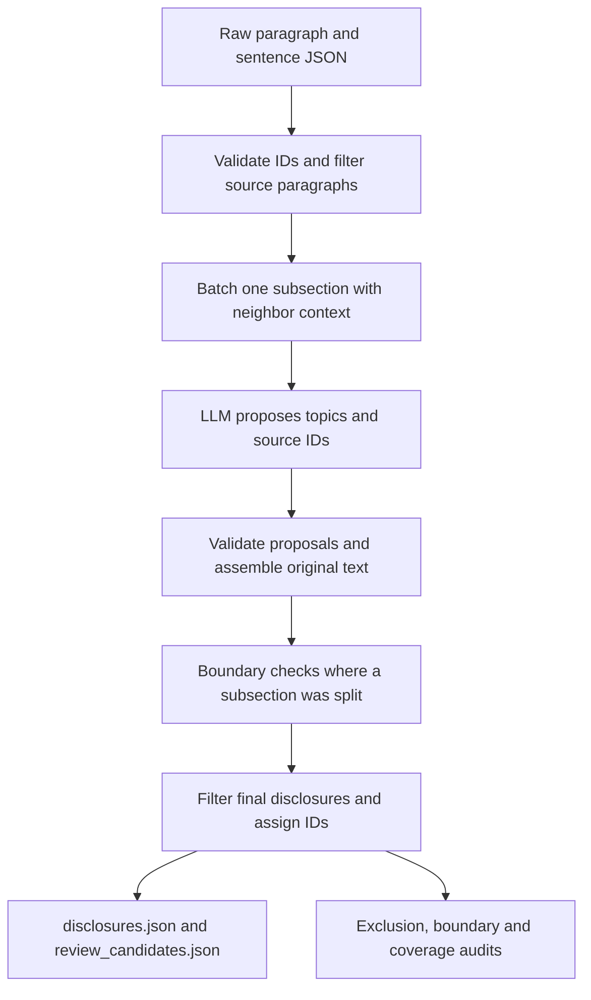

# ZIYANG: Disclosure extraction

**Maintainer:** ZIYANG — contact ZIYANG for disclosure-extraction questions.

## 1. Purpose and implementation status

Turn the saved paragraphs and sentences for one company and fiscal year into
focused disclosures, ready for [alignment](ZIYANG_disclosure_alignment.md). Each
retained disclosure contains selected original evidence, a generated summary,
a topic label and one of the nine content categories.

Implemented: one-subsection grouping, one-sentence/partial-paragraph selections,
pre/post extraction filters, shared batch context, boundary reconciliation,
source validation, parallel year jobs and batches with shared request pacing, optional
fault-tolerant retries/resume, review/audit exports and token accounting. Topic coherence,
summaries and taxonomy are model judgments; source checks do not certify them.
No training, human-review UI or change classification is implemented here.

Use [backend_stage_template.md](backend_stage_template.md) for other stages.

## 2. Code and workflow

| Code | Responsibility |
| --- | --- |
| [`scripts/extract_disclosures.py`](../scripts/extract_disclosures.py) | CLI entry point |
| [`llm/disclosures.py`](../src/sec_disclosure/llm/disclosures.py) | `load_filing`, `make_batches`, `SYSTEM_PROMPT`, model response validation, evidence assembly, `save_outputs`, CLI/resume logic |
| [`llm/disclosure_filters.py`](../src/sec_disclosure/llm/disclosure_filters.py) | Shared single-sentence/trailing-colon predicate and policy identifiers |
| [`llm/disclosure_boundaries.py`](../src/sec_disclosure/llm/disclosure_boundaries.py) | Neighbor context, `BOUNDARY_SYSTEM_PROMPT`, validation and reconciliation of split subsections |
| [`llm/request_pacing.py`](../src/sec_disclosure/llm/request_pacing.py) | Thread-safe request spacing and shared HTTP 429 cooldown for year jobs |
| [`llm/client.py`](../src/sec_disclosure/llm/client.py) and [`config.py`](../src/sec_disclosure/llm/config.py) | API requests and local configuration |



`disclosures.py` writes all extraction outputs. The model returns integer evidence
references; Python retrieves the original text from input files. A disclosure
stays in one SEC Item and one detected subsection (`item_title` path). Parent and
child paths differ; the validator rejects cross-subsection selections.
The workflow above runs separately for every selected year. `--years` overlaps
year jobs while preserving each year's batch and boundary-check order.

**Filtering:** before batching, exclude a paragraph only if it has exactly one
original sentence record and its full text ends with `:` after trailing whitespace
is removed. After boundary reconciliation, apply the same rule to the final
selected disclosure text and sentence count, before assigning disclosure IDs.
Both exclusions go to `excluded_sources.json`; original input files stay intact.
The rules do not require table keywords and amounts do not override them.
Two-sentence paragraphs or single sentences ending in a period survive this rule.
A `possible_missing_table_context` warning alone does not exclude a disclosure.

A whole subsection stays together when it fits the batch target. Large subsections
split at paragraph boundaries. Each sentence belongs to one request; up to two
neighbor paragraphs per side from the same subsection are read-only context,
capped at 4,000 serialized characters per side. Context IDs cannot be selected.
After extraction, model boundary checks may keep independent disclosures or merge
same-topic fragments. They must account for all candidates, preserve the exact
union of selected source IDs, and cannot invent/drop evidence or split candidates.
Checks run in source order; later checks see earlier merges. Invalid checks leave
their candidates unchanged. Missing-table and other unrelated warnings survive.

## 3. Setup

Follow [shared setup](ZIYANG_llm_setup.md) for Python 3.10+, dependencies and `.env`.
Use `--env-file .env` on live commands. Required settings are `SOCLAAS_BASE_URL`,
`SOCLAAS_API_KEY` and `SOCLAAS_MODEL`; never put credentials in output examples.
Dry runs and the offline tests below do not need a key or make API calls.

## 4. Inputs

Upstream producer: [`scripts/extract_filings.py`](../scripts/extract_filings.py).
For each year, supply:

| Input path | Shape and required information |
| --- | --- |
| `data/raw/amd/2024/2024_chunks.json` | Array of paragraphs: `id`, `company`, `year`, `item`, `item_title`, `text`, `source`; optional source block metadata |
| `data/raw/amd/2024/2024_chunk_sentences.json` | Array of sentences: `id`, parent `chunk_id`, `sentence_index`, `text` and matching company/year/Item/subsection metadata |

Use the equivalent paths for 2025. IDs must be unique, sentence parents must
exist, and metadata/source text must agree. The loader records file hashes.
Current supported Items are `1`, `1A`, `7`, `8`, and `15`; actual availability
comes from preprocessing. Tables are not reconstructed by disclosure extraction.

From a fresh clone, prepare both AMD fiscal years with these **SEC network calls,
using no LLM tokens**. Replace the contact placeholder:

```bash
.venv/bin/python scripts/extract_filings.py --ticker amd --year 2024 --user-agent "Your Name your.email@example.com"
.venv/bin/python scripts/extract_filings.py --ticker amd --year 2025 --user-agent "Your Name your.email@example.com"
```

The year is the fiscal report year, not the publication year. Skip this step only
when the required complete raw JSON already exists. `data/` is ignored by Git.

## 5. Run and rerun

Run all commands from the repository root.

### Parallel run with fault tolerance

Use this command to extract **2023, 2024 and 2025 concurrently with automatic
recovery**. All three years' raw input files must already exist. Live extraction
uses API tokens.

```bash
.venv/bin/python scripts/extract_disclosures.py \
  --ticker amd \
  --years 2023 2024 2025 \
  --workers 3 \
  --batch-workers 4 \
  --max-concurrent-requests 8 \
  --output-root data/disclosures_parallel \
  --fault-tolerant \
  --max-retries 3 \
  --retry-backoff 5
```

`--years` selects the filings; `--workers 3` runs up to three year jobs at once.
`--batch-workers 4` runs up to four extraction batches **within each year**.
Together they allow up to 12 active batch jobs; `--max-concurrent-requests 8`
caps simultaneous API calls at eight across the whole invocation. Request starts
remain spaced by the shared default two-second interval.
`--fault-tolerant` retries temporary API errors and invalid replies, with up to
three additional attempts per job. `--retry-backoff 5` starts retry waits at five
seconds. Recoverable failed extraction batches stay recorded while later batches
and other years continue. Failed boundary checks hold their dependent checks.

Outputs, caches and token ledgers are separate under
`data/disclosures_parallel/amd/{2023,2024,2025}/`. Rerun the **same command** to
resume recoverable failed or interrupted jobs and reuse successful cached work.
Unresolved failures remain `run_complete: false`; permanent authentication or
configuration failures need correction. Add `--env-file .env` if using a project
env file instead of the default SoCLaaS configuration.

Validate this parallel command first, **without API calls or output writes**:

```bash
.venv/bin/python scripts/extract_disclosures.py \
  --ticker amd \
  --years 2023 2024 2025 \
  --workers 3 \
  --batch-workers 4 \
  --max-concurrent-requests 8 \
  --output-root data/disclosures_parallel \
  --fault-tolerant \
  --max-retries 3 \
  --retry-backoff 5 \
  --dry-run
```

### Single-year commands

Run batches concurrently even when extracting just **one year**:

```bash
.venv/bin/python scripts/extract_disclosures.py \
  --ticker amd \
  --year 2024 \
  --batch-workers 4 \
  --max-concurrent-requests 4 \
  --output-dir data/disclosures_parallel/amd/2024 \
  --fault-tolerant \
  --max-retries 3 \
  --retry-backoff 5
```

Add `--dry-run` to check this command without API calls or output writes.
This example shares the 2024 output/cache with the multi-year command above;
run one invocation at a time against that directory. Adjusting worker counts,
pacing or the shared concurrency cap preserves cached successful work.

Check input validity and planned batches first; these **do not call the API or
write outputs**:

```bash
.venv/bin/python scripts/extract_disclosures.py --ticker amd --year 2024 --dry-run
.venv/bin/python scripts/extract_disclosures.py --ticker amd --year 2025 --dry-run
```

Fresh live runs **use API tokens**:

```bash
.venv/bin/python scripts/extract_disclosures.py --ticker amd --year 2024 --env-file .env
.venv/bin/python scripts/extract_disclosures.py --ticker amd --year 2025 --env-file .env
```

Defaults are `data/disclosures/amd/2024/` and `data/disclosures/amd/2025/`.
Filters always apply; a directory name such as `disclosures_filtered` does not
activate them. `--data-dir` changes the data root. `--output-dir` specifies the
complete output path for one year.

### Parallel execution and recovery settings

This uses the normal SoCLaaS configuration and writes separate year directories:
`data/disclosures_parallel/amd/2023/`, `2024/` and `2025/`. Add `--env-file .env`
if using a project env file. Add `--dry-run` to validate all years without API
calls or output writes. Pass `--disclosures-dir data/disclosures_parallel` to
alignment afterward. `--year` and `--years` are mutually exclusive;
`--output-dir` is for a single year, while `--output-root` appends company/year.

`--workers` defaults to 3 and caps concurrent year jobs. `--batch-workers`
defaults to 1 and caps extraction batches within each year. For a single year,
only `--batch-workers` controls batch concurrency. The optional
`--max-concurrent-requests` caps simultaneous API calls across all years and
batches; without it, worker counts provide the cap. Each year keeps independent
manifests, caches, disclosure IDs and token ledgers. Batches may finish out of
order, but final disclosure IDs and rows retain source order. Boundary checks
wait for all extraction batches to succeed and then run in source order because
later checks depend on earlier merges. All selected inputs and existing
manifests are checked before live work starts. Logs are prefixed with the year.
A failed year does not stop other year jobs. The overall exit is
`1` if any year fails, `2` if any year remains partial, otherwise `0`.

Multi-year runs and single-year runs with `--batch-workers > 1` share a minimum
2-second interval between API starts
(`--request-interval`). HTTP 429 triggers a shared 60-second cooldown
(`--rate-limit-cooldown`), extended by a numeric `Retry-After` header. Without
`--fault-tolerant`, up to two additional attempts follow HTTP 429
(`--rate-limit-retries`), while other API errors and malformed replies stop the
affected year for explicit inspection/retry. Every attempt is
saved in its year's ledger, including failed attempts with unknown usage.
This pacing reduces bursts; throughput still depends on the account's request
and token limits. Increase the interval or reduce batch/year workers or the
shared concurrency cap for lower limits.
These controls apply within this invocation. Separate CLI processes do not
share a limiter.

For long runs, `--fault-tolerant` enables recovery for both single-year and
multi-year commands:

- Timeouts, connection failures, HTTP 408/409/429 and server errors get bounded
  retries. Authentication, permission, bad-request and exhausted-quota errors
  stop the affected year until corrected.
- Malformed JSON, truncated completions and failed source/schema validation get
  correction prompts using the same owned source IDs and required schema.
- `--max-retries 3` permits at most three additional attempts per job across
  API and response failures. `--retry-backoff 5` waits 5, 10, then 20 seconds;
  longer configured schedules cap the exponential delay at 60 seconds. HTTP 429
  uses the shared cooldown instead, and `--rate-limit-retries` can further limit
  those retries. Its fault-tolerant default is `--max-retries`.
- If a recoverable extraction batch still fails, its failure stays recorded
  while later extraction batches continue. Boundary checks wait until all
  extraction batches succeed. An exhausted boundary check holds its dependent
  checks because their inputs depend on earlier merges.
- Rerunning the same command automatically retries recoverable failed or
  interrupted jobs and reuses successful cached responses. Each invocation has
  its own retry budget; old attempts and their usage remain in the ledger.

An incomplete run stays `run_complete: false` and lists failed/pending jobs in
`token_usage.json`. Unresolved failures return exit `1`; a request-limited run
with only pending work returns `2`. Retry limits prevent an endless loop, and
all retries count toward `--max-requests` per year. Summaries are never accepted
by bypassing source validation. Unexpected client errors are saved as failures;
unexpected year-worker errors are isolated so other years can finish.

Repeat the same command to resume with unchanged inputs/settings. Successful
cached responses are reused; a completed run can regenerate its outputs without
new model calls. Pending extraction and boundary calls still cost tokens. Add
`--max-requests 2` for a pilot allowing at most two **new** requests per year,
including boundary checks and rate-limit retries. With three years this permits
at most six new requests total. Remove that option to continue.

For a **fresh run after changing inputs, filters, prompt, model or batching**,
choose a new output root rather than overwriting an incompatible manifest:

```bash
.venv/bin/python scripts/extract_disclosures.py --ticker amd --year 2024 --env-file .env --output-dir data/disclosures_run2/amd/2024
.venv/bin/python scripts/extract_disclosures.py --ticker amd --year 2025 --env-file .env --output-dir data/disclosures_run2/amd/2025
```

Pass `--disclosures-dir data/disclosures_run2` to alignment for those outputs.
Folder overrides affect storage, not extraction behavior. Historical outputs
are not retroactively filtered or boundary-checked.

Default batching target is 16,000 serialized characters (`--batch-chars`), with
whole paragraphs; oversized paragraphs may exceed it. Boundary checks have a
separate 64,000-character cap including instructions and full selected evidence.
An oversized check fails explicitly; reduce batch size in a new run where useful.
Default completion limit is 6,000 tokens (`--max-tokens`), timeout 180 seconds
(`--timeout`). Single-year requests are sequential; by default `--year` has no
request interval or automatic retries. It can opt into the same pacing/retry
flags. The underlying API client performs no hidden retries.

Without fault-tolerant mode, `--retry-failed` explicitly permits another attempt
after failure/truncation. It also permits a fresh attempt after correcting a
permanent failure in fault-tolerant mode. Old usage remains recorded and missing usage remains
unknown, not zero. `token_usage.json` reports totals and `by_stage.extraction` /
`by_stage.boundary_check`. Cached/reasoning token details, when supplied, are
subsets of totals. There is no verified currency estimate. This extraction CLI
has request limits, not alignment's `--max-total-tokens` flag.

## 6. Final output JSON structure

The current extraction `schema_version` is the **string `"3"`**. The newest
completed local outputs are `disclosures.json` and `review_candidates.json` under
`data/disclosures_run2/amd/{2023,2024,2025}/`. These full JSON documents include
the current `table_introduction_policy` and `post_extraction_filter_policy`.
The field tables below describe the current writer. Extraction files are kept
locally; the fixture contains only the two final JSON files from each newest
2023–2024 and 2024–2025 alignment run, described in the [alignment guide](ZIYANG_disclosure_alignment.md#7-example-data-and-downstream-usage).

### Files

| Output in the year's directory | Purpose |
| --- | --- |
| `disclosures.json` | `disclosures[]` passing source checks |
| `review_candidates.json` | Same envelope and record schema; `disclosures[]` with unresolved concerns |
| `excluded_sources.json` | `excluded[]`: source IDs/text and deterministic or unverified model exclusion reasons |
| `unassigned_sources.json` | `sources[]`: omitted/rejected evidence, with paragraph context |
| `invalid_proposals.json` | `proposals[]`: rejected model selections and exact validation reasons |
| `boundary_checks.json` | `boundaries[]`: check inputs/hashes, candidate decisions, pending/failed status and errors |
| `token_usage.json` | Completion, pending/failed work, source coverage and reported API usage |
| `manifest.json`, `requests/*.json` | Input/config hashes and API-attempt cache for resuming |
| `disclosures.md` | Generated readable report; the current CLI still writes it |

The accepted and review files together form the retained disclosure set; neither
alone is a complete extraction. Alignment also requires the raw evidence, usage
and exclusion/unassigned audit files. `save_outputs()` regenerates these files
from inputs and cached decisions; downstream should not edit them in place.

### Envelope and disclosure fields

Unless marked optional/nullable, the current writer emits these fields and they
are non-null. An empty array means no records, not a missing field.

| JSON field/path | Type | Meaning / allowed values |
| --- | --- | --- |
| `schema_version` | string | `"3"`; reject unsupported contracts rather than silently guessing |
| `company`, `fiscal_year` | string | Lowercase ticker; four-digit fiscal year as text |
| `extraction_scope` | string | `single_subsection` |
| `boundary_policy` | string | `neighbor_context_and_boundary_check_v1` |
| `table_introduction_policy` | string | `exclude_single_sentence_colon_paragraphs_v2` |
| `post_extraction_filter_policy` | string | `exclude_single_sentence_colon_disclosures_v1` |
| `input_hashes` | object<string, string> | Raw file paths mapped to SHA-256 hex digests |
| `note` | string | Scope/interpretation qualifications |
| `disclosures` | array<object> | May be empty |
| `disclosures[].disclosure_id` | string | Company/year/Item disclosure ID, e.g. `amd_2024_1_D001` |
| `company`, `fiscal_year` within a record | string | Match the envelope |
| `item`, `section`, `sections` | string, string, array<string> | SEC Item and full subsection path; `sections` has one member |
| `topic`, `summary` | string | Specific topic label and model-generated factual summary |
| `content` | string | Selected original evidence, in source order; source blocks joined with blank lines |
| `taxonomy` | string | Exactly one of the nine labels below |
| `sources` | nonempty array<object> | Original evidence and paragraph context |
| `verification` | object | Structural/source validation and review information |

Allowed content taxonomy:

- Strategy & Business Model
- Operations & Capacity
- Technology & AI
- Cybersecurity & Data
- Supply Chain & Third Parties
- Regulation, Legal & Compliance
- Financial & Capital Resources
- Human Capital & Organization
- Other / Unclassified

### Source and verification objects

| Nested field | Type / optionality | Meaning |
| --- | --- | --- |
| `sources[].paragraph_id`, `.section` | string | Parent paragraph ID and subsection |
| `.selection` | string enum | `paragraph` or `sentences` |
| `.source_block_index` | integer or null | Original block position if provided upstream |
| `.source_url` | string | Filing source URL/path supplied upstream |
| `.original_paragraph` | string | Complete cleaned paragraph, including any unselected context |
| `.selected_text` | string | Selected evidence; context is not silently added |
| `.sentences` | nonempty array<object> | Each member has required string `sentence_id` and `text` |
| `verification.status` | string enum | `source_validated` or `needs_review` |
| `.checks` | array<string> | Structural checks applied |
| `.source_unit_count` | integer >= 1 | Count of selected sentence records |
| `.review_reasons` | array<string> | Active review tags; empty when clear |
| `.model_review_reason` | string | Model explanation; may be `""` |
| `.boundary_checks` | array<object> | Each has `boundary_id` and status (`pending`, `failed`, `resolved`, `unresolved`); reason, input hash and candidate IDs appear when available |
| `.semantic_review` | string | Qualification that semantics are not independently human-verified |
| `.extraction_batch_ids`, `.source_proposal_ids` | array<string> | Trace selections back to batches/proposals |
| `.ignored_review_reasons` | optional array<string> | Retired warnings retained for audit; absence means none recorded |

One meaningful sentence is valid. Selected sentence IDs are not reused across
retained disclosures; partial paragraphs are allowed. The retired
`fewer_than_two_source_units` and `unassigned_context_in_source_paragraph` flags
do not by themselves require review. Other concerns remain active. Omitted
neighbor sentences still appear in their audit files.

IDs are assigned in source order per Item after filtering and boundary merges.
They are stable only within a finalized run, not globally across fresh model
runs. A pending merge may renumber later IDs. Join by IDs, not array positions;
keep the company/year/run context with them. `run_complete` is in
**`token_usage.json`**, not the disclosure envelope. A nonempty JSON file does
not imply the run has finished.

## 7. Example data and downstream usage

The newest completed local AMD extraction runs are:

| Fiscal year | Source-validated disclosures | Review candidates | Total retained disclosures |
| --- | --- | --- | --- |
| 2023 | 418 | 9 | 427 |
| 2024 | 395 | 10 | 405 |
| 2025 | 420 | 14 | 434 |

All extraction results, source data, audits and API caches remain under local
`data/` directories. `tests/fixtures/alignments/amd/{2023-2024,2024-2025}/` contains
only each newest alignment run's complete `alignments.json` and `needs_review.json`.
The [alignment guide](ZIYANG_disclosure_alignment.md#7-example-data-and-downstream-usage)
records their source runs, counts, hashes and offline copy command.

A downstream reader should combine each year's `disclosures[]` with
`review_candidates.json`'s `disclosures[]`, retaining verification status. Full
alignment outputs and joins are described in the
[alignment guide](ZIYANG_disclosure_alignment.md#7-example-data-and-downstream-usage).

With the local raw filings present, run fresh extraction into a separate
directory. This uses paid API calls:

```bash
.venv/bin/python scripts/extract_disclosures.py --ticker amd --year 2024 --env-file .env --output-dir data/disclosures_rerun/amd/2024
```

Use year 2023 or 2025 and a separate year folder for the other filings. Add `--dry-run`
for local input/batch validation without API calls or output writes.

The alignment fixture files support downstream report reading. Extraction
and alignment reruns require separate source inputs. Cached resume requires
the original compatible manifests and API/runtime state. Fresh extraction
applies the current colon filters and may change disclosure IDs and groupings.

## 8. Validation and limitations

Run the existing offline tests; API calls are mocked, with no key/network needed:

```bash
PYTHONPATH=src .venv/bin/python -m unittest discover -s tests -p 'test_extract_disclosures.py'
PYTHONPATH=src .venv/bin/python -m unittest discover -s tests -p 'test_parallel_extraction.py'
```

Only pass a year's output to alignment when its `token_usage.json` says
`run_complete: true`. Pending/failed extraction or boundary checks keep it false.
Exit `0` means complete, `2` means a request-limited partial run, and `1` means an
error. A completed run can still contain disclosures needing semantic review.

| Boundary review tag | Meaning |
| --- | --- |
| `boundary_check_pending` | Required check has not finished |
| `boundary_check_failed` | API/validation/size failure; see the saved audit |
| `boundary_context_unresolved` | The check ran but did not establish a coherent independent or merged disclosure |

A batch split alone no longer adds `section_continues_across_batch_boundary`.
Old runs retain historical flags; new policies do not certify old outputs.

`source_validated` verifies evidence provenance and structure, not correct topic
boundaries, summary, taxonomy or exclusions. Model-proposed exclusions are
explicitly unverified. Source text is cleaned extraction: HTML tables are absent,
paragraph boundaries may differ from the filing, and a sentence record may hold
multiple grammatical sentences. This stage does not repair preprocessing.
Fresh model runs can group evidence differently. No currency cost or performance
improvement is implied by distributing the saved fixture dataset.
