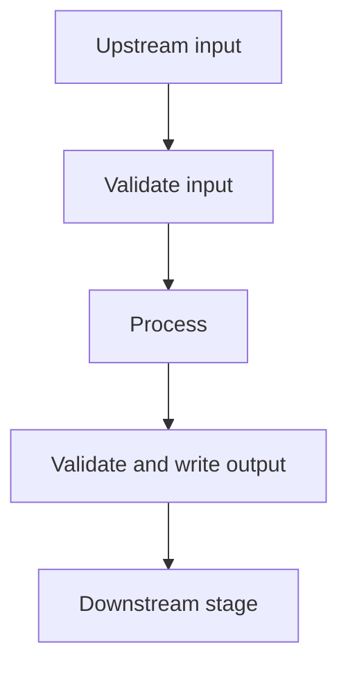

# OWNER: Stage name

**Maintainer:** OWNER — contact OWNER for questions about this stage.

<!-- Copy to docs/<OWNER>_<stage_name>.md using the naming rules below.
     Replace OWNER and these instructions with the actual maintainer/details.
     Use GitHub-compatible relative links; exclude keys and machine-specific paths.
     Mark absent features and fixtures as planned, not implemented. -->

**Naming rules for authors and AI assistants using this template:**

- Save each guide as `docs/<OWNER>_<stage_name>.md`. Use the human maintainer's
  name supplied by the user, not the AI assistant's name.
- Write the owner prefix in uppercase, replacing spaces with underscores. Write
  the stage name in lowercase with underscores. Example:
  `docs/ZIYANG_disclosure_extraction.md`.
- Start the document title with the same owner: `# ZIYANG: Disclosure extraction`.
  Put `**Maintainer:** ZIYANG` directly below it, so readers know whom to ask.
- If the owner is not supplied and cannot be established from the existing
  document, ask for the name before choosing a filename. Do not assign ZIYANG
  to another person's work just because it appears in the example.
- Preserve an existing owner when updating their document unless the user
  explicitly changes ownership. Update relative links when renaming a guide.
- Apply the filename/title convention to setup guides too, even though their
  contents can use the simpler shared-setup format. Keep this reusable template
  named `backend_stage_template.md`, without a personal prefix.

Example prompt to give an AI assistant (replace the owner and stage):

> Use docs/backend_stage_template.md to document disclosure extraction. The
> maintainer is ZIYANG. Save it as docs/ZIYANG_disclosure_extraction.md, put ZIYANG
> in the title and maintainer line, and fill in all eight sections from the code.

## 1. Purpose and implementation status

What this stage does and which downstream stage consumes its results.
What is implemented, what remains unfinished, and what is outside its scope.
Who maintains it; use the same human owner as the filename and maintainer line.

## 2. Code and workflow

Entry-point script and links to the main implementation files.
Their responsibilities, including which code writes each output.
A short flow diagram; distinguish local computation from API calls.

## 3. Setup

Required Python version and dependencies.
Required environment variables, using placeholders only.
Link to [shared setup](ZIYANG_llm_setup.md) where applicable; list additional
stage-specific setup here. Say whether dry runs, tests and live runs need keys.

## 4. Inputs

Required files and locations relative to the repository root.
Expected input structure and which upstream stage produces it.
Prerequisites such as completed runs, schema versions, IDs and source/hash checks.

| Input | Producer | Required fields/shape | Required or optional |
| --- | --- | --- | --- |
| Replace with actual path | Upstream stage | Describe the structure | Required |

## 5. Run and rerun

Exact commands verified against the current CLI, run from the repository root:

- Dry run/local validation, if supported.
- Normal run and its default output directory.
- Optional input/output overrides and what they change.
- How to resume and how to start a fresh run.
- Whether each command uses network access or paid API tokens.
- Relevant request/token limits and unknown-usage accounting.

Use real scripts and flags. Label unimplemented commands as planned.
Do not imply a folder name enables a feature unless the code actually does so.

## 6. Final output JSON structure

Output filenames and their purpose. State which file is canonical and which are
derived views. Include the schema version and link to **complete valid JSON output
files**. An inline excerpt may explain the shape, but label it as an excerpt and
do not substitute it for the full fixture dataset.
Define the top-level envelope and every nested record:

| JSON field/path | Type | Required? | Nullable? | Meaning / allowed values |
| --- | --- | --- | --- | --- |
| Replace with actual field | string/object/array/etc. | Yes/No/Conditional | Yes/No | Definition and enum values, if any |

Explain ID stability across reruns, ordering and joins; omitted fields versus
`null`, `[]` and empty strings; status/completion rules; counts and empty results;
fields downstream may update; refreshing derived views; schema compatibility.

Do not put `...` or comments in JSON advertised as complete. Use the actual saved
outputs for the fixture dataset; do not replace them with invented demo records.
If showing a synthetic illustration in the prose, label it clearly and keep it
distinct from the real dataset. Fabricated decisions are not evaluation results.

## 7. Example data and downstream usage

Location of the **full output dataset** under `tests/fixtures/` to commit with the
docs. Declare the company/year/run scope explicitly. Include every record for
that scope, not just a few examples or the first rows; retain accepted, unmatched,
review and empty outputs, all nested evidence, and all referenced disclosures.
Commands to copy them into a separate `data/` directory without replacing real
results. Which files downstream reads, and how to join them.

Use a completed run for final-output fixtures. Include its raw inputs, audits and
metadata needed to validate references and start a fresh pipeline run. Preserve
the original output bytes, IDs, warnings and counts; do not silently apply a new
policy or relabel an incomplete run as complete. Identify historical code/policy
differences from the current implementation.

Add a dataset manifest with source paths, scope, schema versions, counts, file
sizes and SHA-256 hashes. Verify every referenced ID/citation and that status
views partition the completed master report. Validate the copied data using the
actual downstream loader and an offline/dry-run command where supported.

Distinguish downstream reading, **fresh pipeline reruns**, and **cached resume**.
The full output dataset need not include API response caches, runtime checkpoints
or duplicate readable reports; explicitly list those omissions and explain that
they prevent cached resumption, not downstream access to the full result. Fresh
reruns should use new output directories and may incur API costs. Never claim
cached replay if the original cache or compatible manifest is unavailable.

If no fixtures exist yet, say so rather than providing copy commands for missing
files. Avoid naming a nested fixture directory `data`, since the repository's
`data/` ignore rule can hide it.

## 8. Validation and limitations

Relevant test commands, dependencies and whether they make API calls.
How to recognize complete versus partial results, including exit statuses.
Known limitations, unresolved issues and unsupported inputs.
Distinguish structural validation from semantic accuracy; do not promise identical
fresh model outputs or lower costs without evidence.

Before sharing, check links, CLI options, JSON syntax, fixture references/counts,
and that examples are not ignored by Git. Commit and push the required code,
docs and the declared full fixture dataset together. Exclude `.env`, credentials,
unrelated runs and unneeded runtime caches; keep normal generated `data/` ignored.
